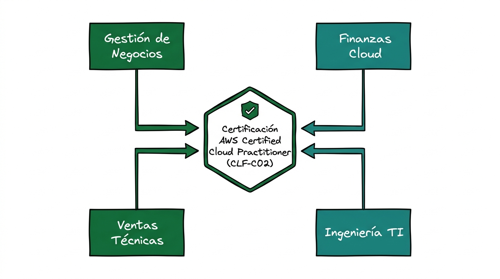
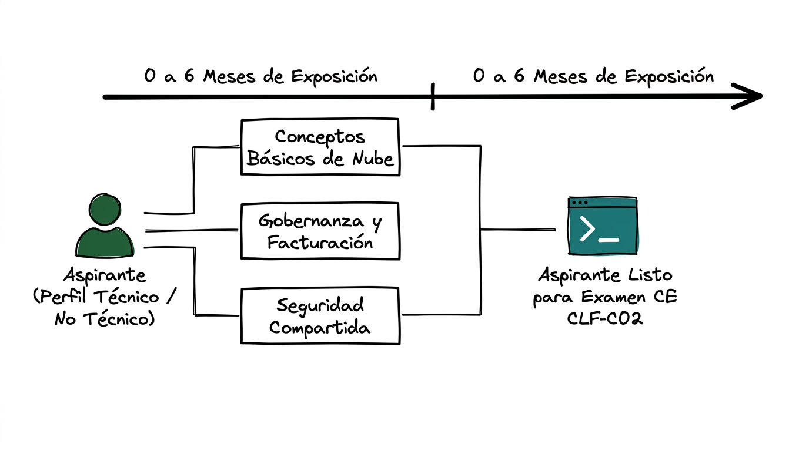
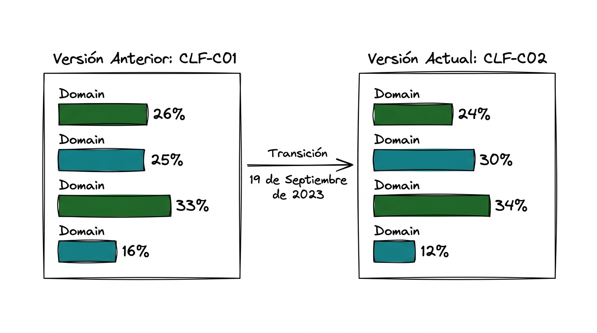
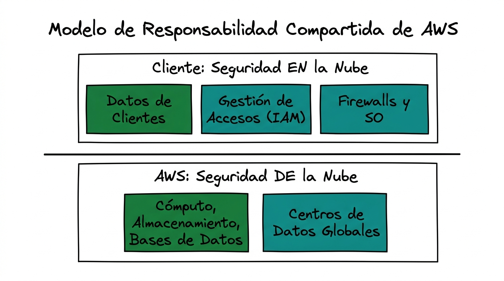
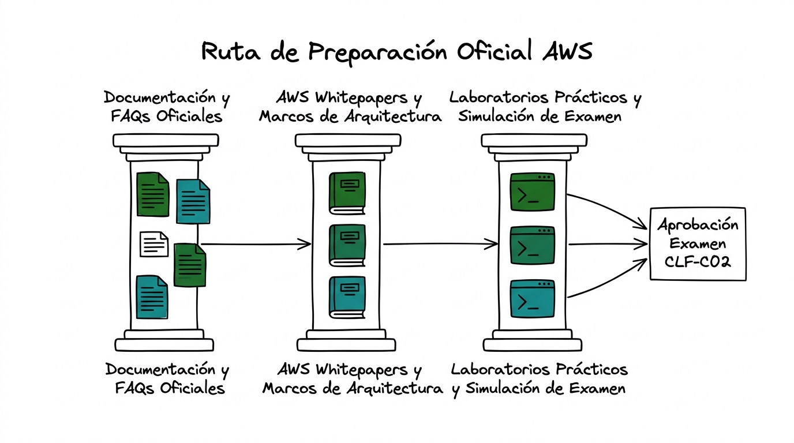

# Guía Técnica: Introducción y Visión General de la Certificación AWS Certified Cloud Practitioner (CLF-C02)

---

## 1. Resumen Ejecutivo y Propósito de la Certificación

La credencial **AWS Certified Cloud Practitioner (CLF-C02)** se posiciona en el nivel fundamental (*Foundational*) del esquema de certificaciones de Amazon Web Services (AWS, 2023). Esta guía técnica compendia y formaliza los lineamientos evaluativos, el temario curricular y la metodología de preparación, sustentados en la documentación técnica y las fuentes primarias oficiales de AWS y organismos de estandarización tecnológica (Mell & Grance, 2011; AWS, 2021).

El propósito formal de esta certificación es validar una comprensión holística del entorno de la nube de AWS, prescindiendo del perfil técnico operativo específico del aspirante (AWS, 2023):

> **Cita textual en inglés (Fuente primaria):**  
> "The AWS Certified Cloud Practitioner (CLF-C02) examination is intended for individuals who have the knowledge and skills necessary to effectively demonstrate an overall understanding of the AWS Cloud, independent of specific technical roles addressed by other AWS certifications." (Amazon Web Services, 2023, p. 1).
> 
> **Traducción al español:**  
> "El examen AWS Certified Cloud Practitioner (CLF-C02) está destinado a personas que poseen los conocimientos y las habilidades necesarias para demostrar de forma eficaz una comprensión global de la nube de AWS, independientemente de los roles técnicos específicos abordados por otras certificaciones de AWS."



> **Prompt de Diagrama Técnico (Estilo Fortinet Minimalista):**  
> ```text
> Prompt: Hand-drawn technical network diagram, isolated on a transparent background (pure solid white for easy cutout), no whiteboard, no background elements. COLORING INSTRUCTION: Highlight ALL components with solid dark green and teal fill colors. Layout: A central badge container labeled "Certificación AWS Certified Cloud Practitioner (CLF-C02)". Surrounding the badge, draw FOUR interconnected rectangular blocks representing foundational roles: "Gestión de Negocios", "Finanzas Cloud", "Ventas Técnicas", and "Ingeniería TI". Connect each block to the central badge with clean directional arrows. Simple line art, Fortinet documentation style, minimalist, Spanish text labels --ar 16:9
> ```

---

## 2. Perfil del Aspirante y Requisitos Previos

Conforme a las especificaciones oficiales de AWS (2023), el examen ha sido estructurado tanto para profesionales con trayectoria en tecnologías de la información (TI) como para perfiles procedentes de áreas de gestión, finanzas, ventas o administración empresarial:

- **Experiencia técnica previa:** No se exige experiencia previa en programación, administración de servidores o arquitectura de sistemas en la nube (AWS, 2023).
- **Público objetivo:** Analistas de negocio, gerentes de proyectos, tomadores de decisiones comerciales y personal de TI que interactúa con equipos de infraestructura cloud (AWS, 2023).
- **Exposición recomendada:** Se sugiere un periodo de hasta seis meses de interacción conceptual o práctica con la nube de AWS, familiarizándose con sus conceptos económicos, de seguridad y de gobernanza (AWS, 2023).



> **Prompt de Diagrama Técnico (Estilo Fortinet Minimalista):**  
> ```text
> Prompt: Hand-drawn technical network diagram, isolated on a transparent background (pure solid white for easy cutout), no whiteboard, no background elements. COLORING INSTRUCTION: Highlight ALL components with solid dark green and teal fill colors. Layout: A horizontal timeline split into two stages labeled "0 a 6 Meses de Exposición". On the left side, draw a user icon labeled "Aspirante (Perfil Técnico / No Técnico)" connected to THREE milestone blocks labeled "Conceptos Básicos de Nube", "Gobernanza y Facturación", and "Seguridad Compartida". On the right side, draw a terminal block labeled "Aspirante Listo para Examen CLF-C02". Simple line art, Fortinet documentation style, minimalist, Spanish text labels --ar 16:9
> ```

---

## 3. Transición Curricular y Actualización del Examen (CLF-C01 a CLF-C02)

A partir del **19 de septiembre de 2023**, AWS retiró formalmente la versión **CLF-C01** y oficializó la versión **CLF-C02** (AWS, 2023). Esta modificación fue el resultado de un análisis riguroso de tareas laborales (*Job Task Analysis*), adaptando los criterios de evaluación al panorama tecnológico actual, con un énfasis reforzado en seguridad, gobernanza y tecnologías emergentes (AWS, 2023).

### Comparativa de Ponderaciones Curriculares

| Dominio de Evaluación | Ponderación CLF-C01 (AWS, 2018) | Ponderación CLF-C02 (AWS, 2023) | Enfoque Evaluativo Principal |
| :--- | :---: | :---: | :--- |
| **Dominio 1: Conceptos de la Nube (*Cloud Concepts*)** | 26% | **24%** | Propuesta de valor, principios de diseño y economía de la nube (AWS, 2021). |
| **Dominio 2: Seguridad y Cumplimiento (*Security and Compliance*)** | 25% | **30%** | Modelo de responsabilidad compartida, IAM y gobernanza de datos (AWS, 2023b). |
| **Dominio 3: Tecnología y Servicios de la Nube (*Cloud Technology and Services*)** | 33% | **34%** | Infraestructura global, servicios de cómputo, almacenamiento, bases de datos, redes e IA/ML (AWS, 2021). |
| **Dominio 4: Facturación, Precios y Soporte (*Billing, Pricing, and Support*)** | 16% | **12%** | Modelos de tarificación *Pay-as-you-go*, presupuestos y niveles de soporte (AWS, 2024a). |



> **Prompt de Diagrama Técnico (Estilo Fortinet Minimalista):**  
> ```text
> Prompt: Hand-drawn technical network diagram, isolated on a transparent background (pure solid white for easy cutout), no whiteboard, no background elements. COLORING INSTRUCTION: Highlight ALL components with solid dark green and teal fill colors. Layout: Two large comparison boxes side by side labeled "Versión Anterior: CLF-C01" (with 4 domain bars: 26%, 25%, 33%, 16%) and "Versión Actual: CLF-C02" (with 4 highlighted domain bars: 24%, 30%, 34%, 12%). Draw an arrow between them labeled "Transición 19 de Septiembre de 2023". Simple line art, Fortinet documentation style, minimalist, Spanish text labels --ar 16:9
> ```

---

## 4. Ejes Temáticos y Fundamentos Doctrinales de AWS

El itinerario curricular se articula en cuatro pilares fundamentales, respaldados por la literatura técnica oficial de AWS:

### 4.1. Fundamentos de la Computación en la Nube y Valor Empresarial
Se define la computación en la nube como un modelo que sustituye las inversiones tradicionales de capital en infraestructura fija (*Capital Expenditures* o CapEx) por costos operativos variables en función del uso real (*Operational Expenditures* o OpEx) (AWS, 2021; Mell & Grance, 2011).

> **Cita textual en inglés (Fuente primaria):**  
> "Cloud computing is the on-demand delivery of compute power, database storage, applications, and other IT resources through a cloud services platform via the internet with pay-as-you-go pricing. Whether you are running applications that share photos to millions of mobile users or you’re supporting the critical operations of your business, a cloud services platform provides rapid access to flexible and low-cost IT resources." (Amazon Web Services, 2021, p. 2).
> 
> **Traducción al español:**  
> "La computación en la nube es la entrega bajo demanda de potencia de cómputo, almacenamiento de bases de datos, aplicaciones y otros recursos de TI a través de una plataforma de servicios en la nube vía internet con precios de pago por uso. Ya sea que se ejecuten aplicaciones que compartan fotografías con millones de usuarios móviles o se respalden las operaciones críticas de una empresa, una plataforma de servicios en la nube proporciona acceso rápido a recursos de TI flexibles y de bajo costo."

### 4.2. Seguridad, Cumplimiento y el Modelo de Responsabilidad Compartida
El marco doctrinario de seguridad de AWS estipula que la protección del entorno cloud no recae de forma exclusiva en ninguna de las dos partes, sino que se distribuye mediante una frontera de responsabilidades claramente delimitada (AWS, 2023b):

> **Cita textual en inglés (Fuente primaria):**  
> "Security and Compliance is a shared responsibility between AWS and the customer. This shared model can help relieve the customer’s operational burden as AWS operates, manages and controls the components from the host operating system and virtualization layer down to the physical security of the facilities in which the service operates." (Amazon Web Services, 2023b, p. 4).
> 
> **Traducción al español:**  
> "La seguridad y el cumplimiento normativo constituyen una responsabilidad compartida entre AWS y el cliente. Este modelo compartido puede ayudar a aliviar la carga operativa del cliente, ya que AWS opera, administra y controla los componentes desde el sistema operativo del host y la capa de virtualización hasta la seguridad física de las instalaciones en las que opera el servicio."

Bajo este esquema, **AWS es responsable de la "seguridad *de* la nube"** (infraestructura física, hardware, centros de datos y capa de virtualización), mientras que **el cliente es responsable de la "seguridad *en* la nube"** (gestión de identidades, configuración del firewall, encriptación y protección de los datos) (AWS, 2023b).

### 4.3. Infraestructura Global y Clasificación de Servicios
La infraestructura mundial de AWS se fundamenta en Regiones geográficas y Zonas de Disponibilidad (*Availability Zones* - AZs) aisladas e interconectadas por redes de baja latencia, complementadas por Puntos de Presencia (*Edge Locations*) para distribución de contenido (AWS, 2021; AWS, 2024b). Los servicios principales analizados comprenden:
- **Cómputo:** Amazon EC2, AWS Lambda, AWS Elastic Beanstalk (AWS, 2021).
- **Almacenamiento:** Amazon S3, Amazon EBS, Amazon EFS (AWS, 2021).
- **Bases de Datos:** Amazon RDS, Amazon DynamoDB (AWS, 2021).
- **Redes y Entrega de Contenido:** Amazon VPC, Amazon CloudFront, AWS Route 53 (AWS, 2021).

### 4.4. Economía, Facturación y Gobernanza Financiera
El marco de gestión de costos de AWS permite a las organizaciones optimizar su gasto mediante herramientas como AWS Cost Explorer, AWS Budgets y AWS Pricing Calculator, además de mecanismos de gobernanza multi-cuenta mediante AWS Organizations (AWS, 2024a).



> **Prompt de Diagrama Técnico (Estilo Fortinet Minimalista):**  
> ```text
> Prompt: Hand-drawn technical network diagram, isolated on a transparent background (pure solid white for easy cutout), no whiteboard, no background elements. COLORING INSTRUCTION: Highlight ALL components with solid dark green and teal fill colors. Layout: A split architecture diagram showing the "Modelo de Responsabilidad Compartida de AWS". The top block labeled "Cliente: Seguridad EN la Nube" contains sub-blocks labeled "Datos de Clientes", "Gestión de Accesos (IAM)", "Firewalls y SO". The bottom block labeled "AWS: Seguridad DE la Nube" contains sub-blocks labeled "Cómputo, Almacenamiento, Bases de Datos" and "Centros de Datos Globales". Solid line separating both sections. Simple line art, Fortinet documentation style, minimalist, Spanish text labels --ar 16:9
> ```

---

## 5. Estrategia de Preparación y Fuentes Primarias de Consulta

Para consolidar el aprendizaje técnico y asegurar el éxito en la evaluación, se recomienda recurrir a las fuentes documentales primarias establecidas por AWS (2023):

1. **Preguntas Frecuentes Oficiales (*AWS FAQs*):** Se aconseja el estudio minucioso de las secciones de FAQs para los servicios nucleares (Amazon EC2, Amazon S3, Amazon VPC, AWS IAM), donde se especifican restricciones de diseño, cuotas de servicio y casos de uso prácticos (AWS, 2024c).
2. **Informes Técnicos Oficiales (*AWS Whitepapers*):** Es fundamental revisar los documentos arquitectónicos de referencia, tales como *Overview of Amazon Web Services* (AWS, 2021) y los pilares del *AWS Well-Architected Framework* (AWS, 2024b).
3. **Simulaciones de Examen y Laboratorios Prácticos:** La resolución de bancos de preguntas basados en escenarios reales y la experimentación en entornos prácticos permiten afianzar la aplicación de los conceptos teóricos (AWS, 2023).



> **Prompt de Diagrama Técnico (Estilo Fortinet Minimalista):**  
> ```text
> Prompt: Hand-drawn technical network diagram, isolated on a transparent background (pure solid white for easy cutout), no whiteboard, no background elements. COLORING INSTRUCTION: Highlight ALL components with solid dark green and teal fill colors. Layout: A three-pillar learning pipeline labeled "Ruta de Preparación Oficial AWS". Pillar 1 labeled "Documentación y FAQs Oficiales" with document icons. Pillar 2 labeled "AWS Whitepapers y Marcos de Arquitectura" with book icons. Pillar 3 labeled "Laboratorios Prácticos y Simulación de Examen" with console and terminal icons. All three converge into a final target labeled "Aprobación Examen CLF-C02". Simple line art, Fortinet documentation style, minimalist, Spanish text labels --ar 16:9
> ```

---

## 6. Referencias Bibliográficas (Norma APA 7.ª Edición)

- Amazon Web Services. (2018). *AWS Certified Cloud Practitioner (CLF-C01) Exam Guide*. AWS Training and Certification.
- Amazon Web Services. (2021). *Overview of Amazon Web Services: AWS Whitepaper*. AWS Documentation. https://docs.aws.amazon.com/whitepapers/latest/aws-overview/aws-overview.pdf
- Amazon Web Services. (2023). *AWS Certified Cloud Practitioner (CLF-C02) Exam Guide* (Version 2.0). AWS Training and Certification. https://d1.awsstatic.com/training-and-certification/docs-cloud-practitioner/AWS-Certified-Cloud-Practitioner_Exam-Guide.pdf
- Amazon Web Services. (2023b). *AWS Security Best Practices: AWS Whitepaper*. AWS Documentation. https://docs.aws.amazon.com/whitepapers/latest/aws-security-best-practices/aws-security-best-practices.pdf
- Amazon Web Services. (2024a). *How AWS Pricing Works: AWS Whitepaper*. AWS Documentation. https://docs.aws.amazon.com/whitepapers/latest/how-aws-pricing-works/how-aws-pricing-works.pdf
- Amazon Web Services. (2024b). *AWS Well-Architected Framework: Reliability Pillar*. AWS Whitepapers. https://docs.aws.amazon.com/wellarchitected/latest/reliability-pillar/welcome.html
- Amazon Web Services. (2024c). *Amazon Web Services FAQs Documentation Hub*. AWS Documentation. https://aws.amazon.com/faqs/
- Mell, P., & Grance, T. (2011). *The NIST Definition of Cloud Computing* (Special Publication 800-145). National Institute of Standards and Technology. https://doi.org/10.6028/NIST.SP.800-145
