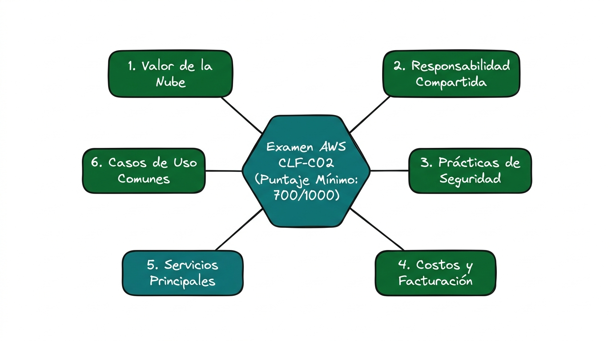
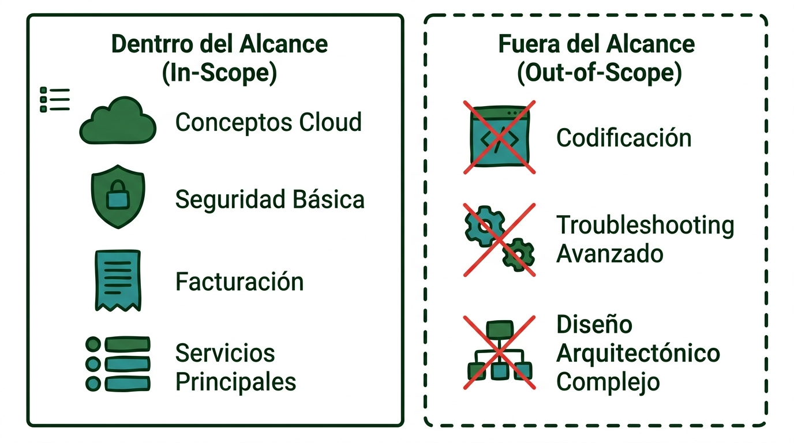
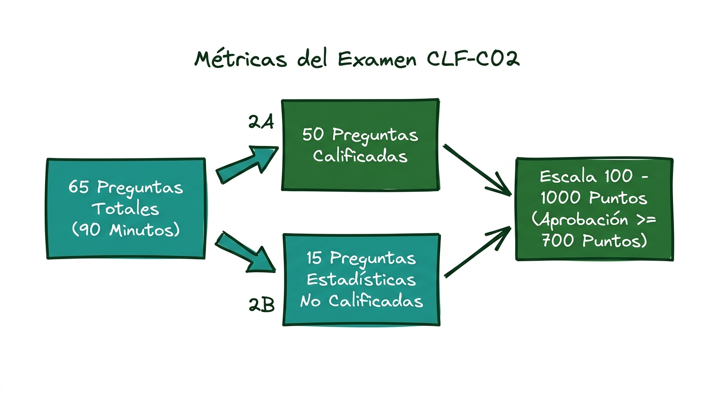
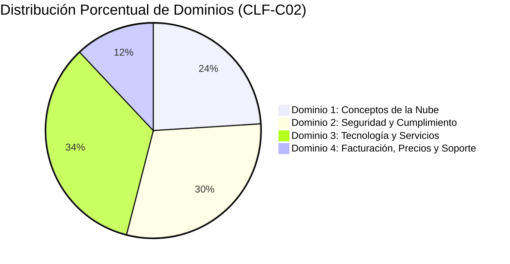
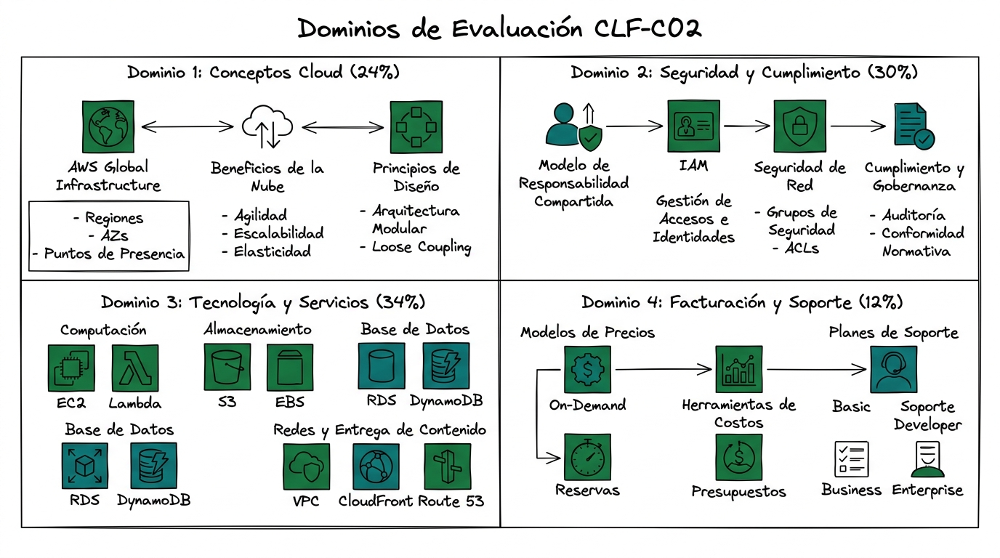

# Guía Técnica: Descripción General del Examen AWS Certified Cloud Practitioner (CLF-C02)

---

## 1. Resumen Ejecutivo y Alcance del Examen

El examen **AWS Certified Cloud Practitioner (CLF-C02)** valida la competencia técnica inicial para describir la propuesta de valor global de la infraestructura en la nube de Amazon Web Services (AWS, 2023). La certificación certifica la comprensión transversal de los principios arquitectónicos, modelos de seguridad compartida, aspectos económicos y los servicios centrales que componen la plataforma (AWS, 2023).

> **Cita textual en inglés (Fuente primaria):**  
> "The exam validates a candidate’s ability to complete the following tasks: Explain the value of the AWS Cloud; Understand and explain the AWS shared responsibility model; Understand security best practices; Understand AWS Cloud costs, economics, and billing practices; Describe and position the core AWS services, including compute, network, database, and storage services; Identify AWS services for common use cases." (Amazon Web Services, 2023, p. 1).
> 
> **Traducción al español:**  
> "El examen valida la capacidad del candidato para completar las siguientes tareas: Explicar el valor de la nube de AWS; Comprender y explicar el modelo de responsabilidad compartida de AWS; Comprender las mejores prácticas de seguridad; Comprender los costos, la economía y las prácticas de facturación de AWS Cloud; Describir y posicionar los servicios centrales de AWS, incluidos los servicios de cómputo, redes, bases de datos y almacenamiento; e Identificar servicios de AWS para casos de uso comunes."



> **Prompt de Diagrama Técnico:**  
> ```text
> Prompt: Hand-drawn technical network diagram, isolated on a transparent background (pure solid white for easy cutout), no whiteboard, no background elements. COLORING INSTRUCTION: Highlight ALL components with solid dark green and teal fill colors. Layout: A central hexagon labeled "Examen AWS CLF-C02 (Puntaje Mínimo: 700/1000)". Radiating outward from the hexagon, draw SIX rounded rectangular nodes labeled: "1. Valor de la Nube", "2. Responsabilidad Compartida", "3. Prácticas de Seguridad", "4. Costos y Facturación", "5. Servicios Principales", and "6. Casos de Uso Comunes". Connect each node with clean solid lines. Simple line art, minimalist, Spanish text labels --ar 16:9
> ```

---

## 2. Perfil de la Audiencia Objetivo y Delimitación de Alcance

### 2.1. Audiencia Destinataria
El examen está concebido para perfiles de diversa índole profesional:
- **Candidatos de perfiles no técnicos:** Profesionales de áreas financieras, de ventas, jurídicas, adquisiciones o gestión que interactúan con tecnologías basadas en la nube (AWS, 2023).
- **Profesionales en etapas iniciales de TI:** Personas que inician su trayectoria en cloud computing o que aspiran a certificaciones de nivel *Associate* o *Specialty* (AWS, 2023).
- **Experiencia sugerida:** Hasta seis meses de exposición práctica o conceptual en diseño, implementación u operaciones en la nube de AWS (AWS, 2023).

### 2.2. Competencias Dentro y Fuera de Alcance (*Scope Definition*)

| Dentro del Alcance (*In Scope*) | Fuera del Alcance (*Out of Scope*) |
| :--- | :--- |
| Explicar la propuesta de valor y los beneficios de AWS Cloud (AWS, 2021). | Desarrollo de código y programación de software (AWS, 2023). |
| Describir el Modelo de Responsabilidad Compartida y mejores prácticas de seguridad (AWS, 2023b). | Diseño complejo de arquitecturas en la nube (AWS, 2023). |
| Comprender la economía de la nube, modelos de tarificación y facturación (AWS, 2024a). | Solución de problemas técnicos profundos (*Troubleshooting*) (AWS, 2023). |
| Posicionar servicios clave de cómputo, almacenamiento, bases de datos y redes (AWS, 2021). | Implementación y aprovisionamiento avanzado en consola/CLI (AWS, 2023). |
| Identificar servicios idóneos para casos de uso empresariales frecuentes (AWS, 2024b). | Pruebas de carga, rendimiento y pruebas de estrés (*Stress testing*) (AWS, 2023). |



> **Prompt de Diagrama Técnico:**  
> ```text
> Prompt: Hand-drawn technical network diagram, isolated on a transparent background (pure solid white for easy cutout), no whiteboard, no background elements. COLORING INSTRUCTION: Highlight ALL components with solid dark green and teal fill colors. Layout: Two adjacent rectangular zones. Left zone with solid green border labeled "Dentro del Alcance (In-Scope)" containing list icons labeled "Conceptos Cloud", "Seguridad Básica", "Facturación", "Servicios Principales". Right zone with dashed border labeled "Fuera del Alcance (Out-of-Scope)" containing crossed-out icons labeled "Codificación", "Troubleshooting Avanzado", "Diseño Arquitectónico Complejo". Simple line art, minimalist, Spanish text labels --ar 16:9
> ```

---

## 3. Especificaciones y Estructura del Examen

Conforme a los estándares oficiales de evaluación de AWS (2023), los parámetros de administración del examen se resumen a continuación:

- **Cantidad de preguntas:** 65 preguntas en total.
  - **50 preguntas puntuadas:** Determinan directamente la calificación final.
  - **15 preguntas no puntuadas (*Unscored items*):** Reactivos de prueba estadística insertados aleatoriamente que no afectan la calificación y no son identificables por el aspirante (AWS, 2023).
- **Tiempo asignado:** 90 minutos de duración.
- **Escala de calificación:** Puntuación escalada de 100 a 1.000 puntos.
- **Puntuación mínima de aprobación:** **700 puntos** (AWS, 2023).
- **Modelo de calificación compensatoria:** No se requiere aprobar cada sección de manera individual; la evaluación se rige por el rendimiento global acumulado (AWS, 2023).
- **Tipología de reactivos:**
  - *Opción múltiple:* 1 respuesta correcta y 3 distractores.
  - *Respuesta múltiple:* 2 o más respuestas correctas entre 5 o más opciones.
  - *Penalización:* No existe penalización por respuestas incorrectas; las preguntas no contestadas se computan como erróneas (AWS, 2023).
- **Políticas de retoma y vigencia:**
  - *Costo:* 100 USD más impuestos aplicables por intento (AWS, 2023).
  - *Periodo de espera para retoma:* 14 días naturales en caso de no aprobación.
  - *Vigencia de la certificación:* 3 años a partir de la fecha de aprobación (AWS, 2023).
  - *Modalidades de examen:* Presencial en centros autorizados Pearson VUE o en línea supervisado (*Online Proctoring*) (AWS, 2023).



> **Prompt de Diagrama Técnico:**  
> ```text
> Prompt: Hand-drawn technical network diagram, isolated on a transparent background (pure solid white for easy cutout), no whiteboard, no background elements. COLORING INSTRUCTION: Highlight ALL components with solid dark green and teal fill colors. Layout: A process flow chart labeled "Métricas del Examen CLF-C02". Box 1: "65 Preguntas Totales (90 Minutos)". Connecting arrows split into Box 2A: "50 Preguntas Calificadas" and Box 2B: "15 Preguntas Estadísticas No Calificadas". Both converge into Box 3: "Escala 100 - 1000 Puntos (Aprobación >= 700 Puntos)". Simple line art, minimalist, Spanish text labels --ar 16:9
> ```

---

## 4. Desglose Detallado de Dominios y Tareas (CLF-C02)



### Dominio 1: Conceptos de la Nube (*Cloud Concepts*) – 24%
1. **Tarea 1.1:** Definir los beneficios de la nube de AWS (seguridad, fiabilidad, alta disponibilidad, elasticidad, agilidad, escala global) (AWS, 2021).
2. **Tarea 1.2:** Identificar los principios de diseño de la nube de AWS (*Well-Architected Framework*) (AWS, 2024b).
3. **Tarea 1.3:** Comprender los beneficios y estrategias de migración a la nube (ej. *Cloud Adoption Framework* - CAF) (AWS, 2021).
4. **Tarea 1.4:** Comprender los conceptos de economía y optimización de costos en la nube (AWS, 2024a).

### Dominio 2: Seguridad y Cumplimiento (*Security and Compliance*) – 30%
1. **Tarea 2.1:** Comprender el Modelo de Responsabilidad Compartida de AWS (AWS, 2023b).
2. **Tarea 2.2:** Comprender los conceptos de seguridad, gobernanza y cumplimiento normativo en AWS (AWS, 2023b).
3. **Tarea 2.3:** Identificar las capacidades de administración de identidades y accesos (AWS IAM) (AWS, 2023b).
4. **Tarea 2.4:** Identificar componentes y herramientas de seguridad (AWS Shield, AWS WAF, AWS KMS, Amazon Inspector) (AWS, 2023b).

### Dominio 3: Tecnología y Servicios de la Nube (*Cloud Technology and Services*) – 34%
1. **Tarea 3.1:** Definir los métodos de despliegue y operación en la nube (Consola, CLI, SDKs, IaC con AWS CloudFormation) (AWS, 2021).
2. **Tarea 3.2:** Definir la infraestructura global de AWS (Regiones, Zonas de Disponibilidad, *Local Zones*, *Edge Locations*) (AWS, 2021).
3. **Tarea 3.3:** Identificar los servicios centrales de cómputo (EC2, Lambda, ECS, EKS), bases de datos (RDS, DynamoDB), redes (VPC, Route 53) y almacenamiento (S3, EBS, EFS) (AWS, 2021).
4. **Tarea 3.4:** Identificar servicios de inteligencia artificial, aprendizaje automático y analítica (Amazon SageMaker, Amazon Athena, Amazon QuickSight) (AWS, 2021).
5. **Tarea 3.5:** Identificar servicios adicionales dentro del alcance oficial (AWS, 2023).

### Dominio 4: Facturación, Precios y Soporte (*Billing, Pricing, and Support*) – 12%
1. **Tarea 4.1:** Comparar los modelos de precios de AWS (*On-Demand*, *Savings Plans*, *Reserved Instances*, *Spot Instances*) (AWS, 2024a).
2. **Tarea 4.2:** Comprender los recursos para la gestión de facturación, presupuestos y costos (AWS Cost Explorer, AWS Budgets, Cost and Usage Report) (AWS, 2024a).
3. **Tarea 4.3:** Identificar recursos técnicos y planes de soporte de AWS (*Basic*, *Developer*, *Business*, *Enterprise On-Ramp*, *Enterprise*) (AWS, 2023; AWS, 2024a).



> **Prompt de Diagrama Técnico:**  
> ```text
> Prompt: Hand-drawn technical network diagram, isolated on a transparent background (pure solid white for easy cutout), no whiteboard, no background elements. COLORING INSTRUCTION: Highlight ALL components with solid dark green and teal fill colors. Layout: A large quadrant architecture diagram labeled "Dominios de Evaluación CLF-C02". Quadrant 1 (Top-Left): "Dominio 1: Conceptos Cloud (24%)". Quadrant 2 (Top-Right): "Dominio 2: Seguridad y Cumplimiento (30%)". Quadrant 3 (Bottom-Left): "Dominio 3: Tecnología y Servicios (34%)". Quadrant 4 (Bottom-Right): "Dominio 4: Facturación y Soporte (12%)". Each quadrant contains 3-4 internal service icons. Simple line art, minimalist, Spanish text labels --ar 16:9
> ```

---

## 5. Referencias Bibliográficas (Norma APA 7.ª Edición)

- Amazon Web Services. (2021). *Overview of Amazon Web Services: AWS Whitepaper*. AWS Documentation. https://docs.aws.amazon.com/whitepapers/latest/aws-overview/aws-overview.pdf
- Amazon Web Services. (2023). *AWS Certified Cloud Practitioner (CLF-C02) Exam Guide* (Version 2.0). AWS Training and Certification. https://d1.awsstatic.com/training-and-certification/docs-cloud-practitioner/AWS-Certified-Cloud-Practitioner_Exam-Guide.pdf
- Amazon Web Services. (2023b). *AWS Security Best Practices: AWS Whitepaper*. AWS Documentation. https://docs.aws.amazon.com/whitepapers/latest/aws-security-best-practices/aws-security-best-practices.pdf
- Amazon Web Services. (2024a). *How AWS Pricing Works: AWS Whitepaper*. AWS Documentation. https://docs.aws.amazon.com/whitepapers/latest/how-aws-pricing-works/how-aws-pricing-works.pdf
- Amazon Web Services. (2024b). *AWS Well-Architected Framework: Reliability Pillar*. AWS Whitepapers. https://docs.aws.amazon.com/wellarchitected/latest/reliability-pillar/welcome.html
