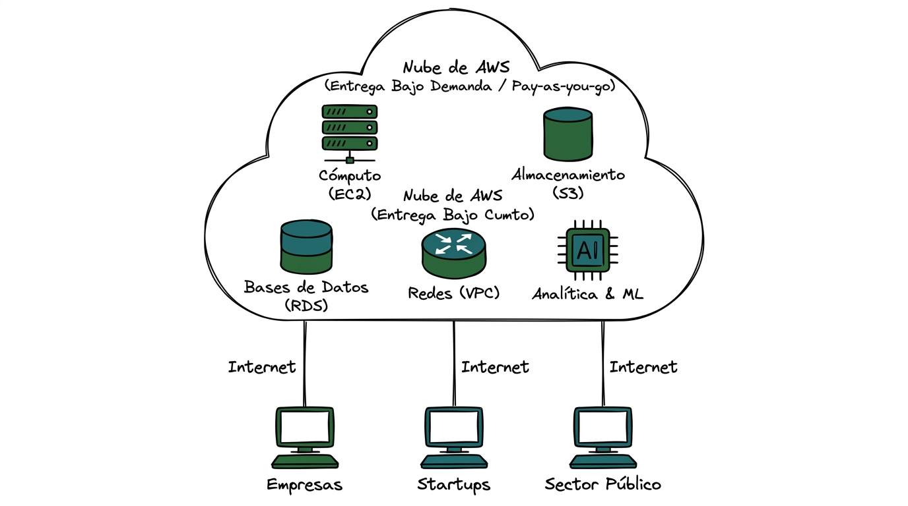
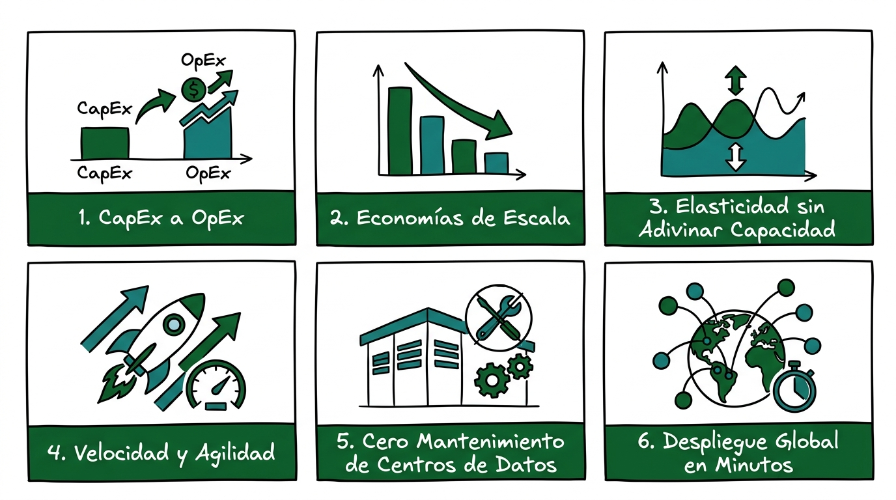
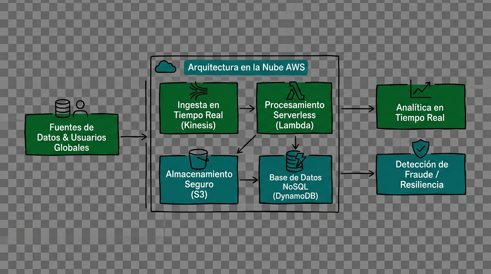

# Guía Técnica: Fundamentos y Conceptos de la Computación en la Nube

---

## 1. Resumen Ejecutivo y Definición Doctrinal

La **computación en la nube** (*Cloud Computing*) representa un cambio de paradigma en la provisión, consumo y gestión de recursos tecnológicos. Se define como la entrega bajo demanda de recursos de tecnologías de la información (TI) a través de Internet con un esquema de precios de pago por uso (*Pay-as-you-go*) (AWS, 2021; Mell & Grance, 2011).

El Instituto Nacional de Estándares y Tecnología de los Estados Unidos (NIST) establece la definición formal de referencia:

> **Cita textual en inglés (Fuente primaria):**  
> "Cloud computing is a model for enabling ubiquitous, convenient, on-demand network access to a shared pool of configurable computing resources (e.g., networks, servers, storage, applications, and services) that can be rapidly provisioned and released with minimal management effort or service provider interaction." (Mell & Grance, 2011, p. 2).
> 
> **Traducción al español:**  
> "La computación en la nube es un modelo que permite el acceso de red ubicuo, conveniente y bajo demanda a un conjunto compartido de recursos de computación configurables (por ejemplo, redes, servidores, almacenamiento, aplicaciones y servicios) que pueden aprovisionarse y liberarse rápidamente con un esfuerzo de gestión o una interacción mínimos con el proveedor del servicio."

En contraposición a la adquisición y mantenimiento tradicional de centros de datos físicos locales (*On-premises*), el modelo en la nube permite acceder a capacidad de cómputo, bases de datos y almacenamiento elástico suministrados por proveedores de infraestructura como Amazon Web Services (AWS, 2021).



> **Prompt de Diagrama Técnico (Estilo Fortinet Minimalista):**  
> ```text
> Prompt: Hand-drawn technical network diagram, isolated on a transparent background (pure solid white for easy cutout), no whiteboard, no background elements. COLORING INSTRUCTION: Highlight ALL components with solid dark green and teal fill colors. Layout: A large central cloud boundary labeled "Nube de AWS (Entrega Bajo Demanda / Pay-as-you-go)". Inside the cloud boundary, draw FIVE component icons: a server rack labeled "Cómputo (EC2)", a storage cylinder labeled "Almacenamiento (S3)", a database block labeled "Bases de Datos (RDS)", a router icon labeled "Redes (VPC)", and an AI chip labeled "Analítica & ML". Below the cloud, draw THREE client terminal icons labeled "Empresas", "Startups", and "Sector Público" connected to the cloud via vertical internet lines. Simple line art, Fortinet documentation style, minimalist, Spanish text labels --ar 16:9
> ```

---

## 2. Las Seis Ventajas Cardinales de la Nube según AWS

De acuerdo con el marco doctrinario de AWS (2021), la adopción de la nube otorga seis ventajas estratégicas esenciales:

```mermaid
mindmap
  root((Ventajas de la Nube AWS))
    (1) Sustituir CapEx por OpEx
    (2) Economías de Escala Masivas
    (3) Dejar de Estimar Capacidad
    (4) Aumento de Velocidad y Agilidad
    (5) Eliminación del Mantenimiento de Centros de Datos
    (6) Despliegue Global en Minutos
```

1. **Sustitución del Gasto de Capital por Gasto Variable (*Trade capital expense for variable expense*):** Se elimina la necesidad de realizar cuantiosas inversiones anticipadas en hardware físico (*CapEx*), sustituyéndolas por costos operativos variables (*OpEx*) proporcionales al consumo real (AWS, 2021; AWS, 2024a).
2. **Beneficio de las Economías de Escala Masivas (*Benefit from massive economies of scale*):** Al consolidar las cargas de trabajo de cientos de miles de clientes, AWS logra costos agregados más bajos que se traducen en reducciones continuas de precios para el usuario final (AWS, 2021).
3. **Eliminación de la Estimación de Capacidad (*Stop guessing capacity*):** Se evita el aprovisionamiento excesivo (*over-provisioning*) o insuficiente (*under-provisioning*). La infraestructura escala dinámicamente de forma automática en función de la demanda (AWS, 2024b).
4. **Incremento de la Velocidad y la Agilidad (*Increase speed and agility*):** La disponibilidad inmediata de recursos reduce el tiempo requerido para aprovisionar infraestructura de semanas o meses a cuestión de minutos (AWS, 2021).
5. **Enfoque en el Negocio Principal (*Stop spending money running and maintaining data centers*):** Las organizaciones delegan las tareas operativas de alimentación eléctrica, refrigeración, cableado y mantenimiento físico a AWS, concentrando su talento en la innovación de aplicaciones y servicios (AWS, 2021; AWS, 2023b).
6. **Despliegue Global en Cuestión de Minutos (*Go global in minutes*):** Mediante la infraestructura global de AWS (Regiones y Zonas de Disponibilidad), las aplicaciones pueden desplegarse en múltiples ubicaciones geográficas con baja latencia para los usuarios finales (AWS, 2021).



> **Prompt de Diagrama Técnico (Estilo Fortinet Minimalista):**  
> ```text
> Prompt: Hand-drawn technical network diagram, isolated on a transparent background (pure solid white for easy cutout), no whiteboard, no background elements. COLORING INSTRUCTION: Highlight ALL components with solid dark green and teal fill colors. Layout: A grid of SIX rectangular architectural cards labeled: "1. CapEx a OpEx", "2. Economías de Escala", "3. Elasticidad sin Adivinar Capacidad", "4. Velocidad y Agilidad", "5. Cero Mantenimiento de Centros de Datos", "6. Despliegue Global en Minutos". Each card contains a descriptive technical icon. Simple line art, Fortinet documentation style, minimalist, Spanish text labels --ar 16:9
> ```

---

## 3. Casos de Uso Empresariales e Industriales

El espectro de aplicación de los servicios en la nube abarca tanto requerimientos de infraestructura base como tecnologías avanzadas (AWS, 2021):

| Sector / Dominio | Caso de Uso Principal | Servicios de AWS Involucrados |
| :--- | :--- | :--- |
| **Continuidad del Negocio** | Respaldo de información (*Backup*) y recuperación ante desastres (*Disaster Recovery - DR*). | Amazon S3, AWS Backup, S3 Glacier (AWS, 2021). |
| **Sector Financiero** | Detección y prevención de fraudes en tiempo real y análisis de transacciones de alta velocidad. | Amazon Kinesis, Amazon SageMaker, Amazon DynamoDB (AWS, 2021). |
| **Sector Salud y Biotecnología** | Genómica, procesamiento de historiales clínicos y medicina personalizada a gran escala. | AWS Lambda, Amazon S3, Amazon EC2 (AWS, 2021). |
| **Entretenimiento y Videojuegos** | Transmisión multimedia masiva y distribución de videojuegos multijugador a nivel mundial. | Amazon CloudFront, AWS GameLift, Amazon Route 53 (AWS, 2021). |
| **Analítica y Big Data** | Procesamiento masivo de datos e inteligencia de negocios. | Amazon EMR, Amazon Redshift, Amazon Athena (AWS, 2021). |



> **Prompt de Diagrama Técnico (Estilo Fortinet Minimalista):**  
> ```text
> Prompt: Hand-drawn technical network diagram, isolated on a transparent background (pure solid white for easy cutout), no whiteboard, no background elements. COLORING INSTRUCTION: Highlight ALL components with solid dark green and teal fill colors. Layout: A horizontal enterprise workflow. On the left, draw an input block labeled "Fuentes de Datos & Usuarios Globales". In the center, draw a processing container labeled "Arquitectura en la Nube AWS" containing sub-blocks "Ingesta en Tiempo Real (Kinesis)", "Almacenamiento Seguro (S3)", "Procesamiento Serverless (Lambda)", and "Base de Datos NoSQL (DynamoDB)". On the right, draw TWO output blocks labeled "Analítica en Tiempo Real" and "Detección de Fraude / Resiliencia". Simple line art, Fortinet documentation style, minimalist, Spanish text labels --ar 16:9
> ```

---

## 4. Citas Textuales y Fuentes Primarias de Referencia

> **Cita textual en inglés (Fuente primaria):**  
> "In the simplest terms, cloud computing is the delivery of on-demand computing services—from applications to storage and processing power—typically over the internet and on a pay-as-you-go basis. Rather than maintaining your own datacenter, you can access whatever you need, when you need it, from a cloud provider." (Amazon Web Services, 2021, p. 3).
> 
> **Traducción al español:**  
> "En los términos más sencillos, la computación en la nube es la entrega de servicios informáticos bajo demanda —desde aplicaciones hasta almacenamiento y potencia de procesamiento—, típicamente a través de internet y con un esquema de pago por uso. En lugar de mantener su propio centro de datos, usted puede acceder a lo que necesite, cuando lo necesite, desde un proveedor de la nube."

---

## 5. Referencias Bibliográficas (Norma APA 7.ª Edición)

- Amazon Web Services. (2021). *Overview of Amazon Web Services: AWS Whitepaper*. AWS Documentation. https://docs.aws.amazon.com/whitepapers/latest/aws-overview/aws-overview.pdf
- Amazon Web Services. (2023). *AWS Certified Cloud Practitioner (CLF-C02) Exam Guide* (Version 2.0). AWS Training and Certification. https://d1.awsstatic.com/training-and-certification/docs-cloud-practitioner/AWS-Certified-Cloud-Practitioner_Exam-Guide.pdf
- Amazon Web Services. (2023b). *AWS Security Best Practices: AWS Whitepaper*. AWS Documentation. https://docs.aws.amazon.com/whitepapers/latest/aws-security-best-practices/aws-security-best-practices.pdf
- Amazon Web Services. (2024a). *How AWS Pricing Works: AWS Whitepaper*. AWS Documentation. https://docs.aws.amazon.com/whitepapers/latest/how-aws-pricing-works/how-aws-pricing-works.pdf
- Amazon Web Services. (2024b). *AWS Well-Architected Framework: Reliability Pillar*. AWS Whitepapers. https://docs.aws.amazon.com/wellarchitected/latest/reliability-pillar/welcome.html
- Mell, P., & Grance, T. (2011). *The NIST Definition of Cloud Computing* (Special Publication 800-145). National Institute of Standards and Technology. https://doi.org/10.6028/NIST.SP.800-145
