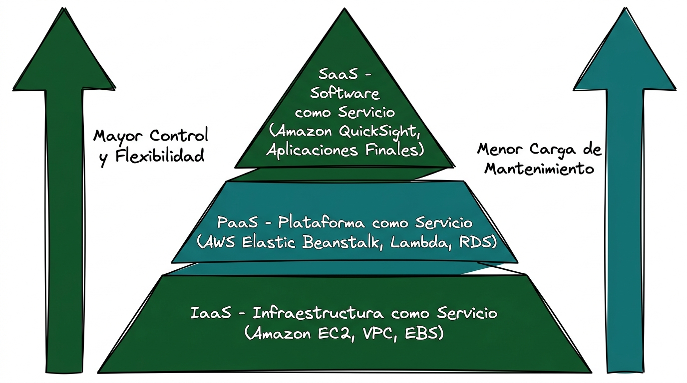

# Guía Técnica: Modelos de Servicios de Computación en la Nube (IaaS, PaaS, SaaS)

---

## 1. Resumen Ejecutivo y Marco Conceptual

En el ámbito de las tecnologías de la información, un **modelo de servicio** (*Cloud Service Delivery Model*) determina el nivel de control, flexibilidad, gestión y responsabilidad que asume el cliente frente al proveedor de la nube (AWS, 2021; Mell & Grance, 2011).

El Instituto Nacional de Estándares y Tecnología (NIST) y Amazon Web Services clasifican los servicios en la nube en tres arquitecturas fundamentales: **Infraestructura como Servicio (IaaS)**, **Plataforma como Servicio (PaaS)** y **Software como Servicio (SaaS)**, precedidas por el esquema tradicional local (*On-premises*) (AWS, 2021; Mell & Grance, 2011).

> **Cita textual en inglés (Fuente primaria):**  
> "Cloud computing services fall into three main categories: Infrastructure as a Service (IaaS), Platform as a Service (PaaS), and Software as a Service (SaaS). These are sometimes called the cloud computing stack because they build on top of one another. Knowing what they are and how they are different makes it easier to accomplish your business goals." (Amazon Web Services, 2021, p. 3).
> 
> **Traducción al español:**  
> "Los servicios de computación en la nube se dividen en tres categorías principales: Infraestructura como Servicio (IaaS), Plataforma como Servicio (PaaS) y Software como Servicio (SaaS). A veces se les denomina la pila de computación en la nube porque se construyen una sobre otra. Conocer qué son y en qué se diferencian facilita el cumplimiento de sus objetivos empresariales."



> **Prompt de Diagrama Técnico:**  
> ```text
> Prompt: Hand-drawn technical network diagram, isolated on a transparent background (pure solid white for easy cutout), no whiteboard, no background elements. COLORING INSTRUCTION: Highlight ALL components with solid dark green and teal fill colors. Layout: A layered pyramid stack of cloud computing models. Bottom layer (Broadest base): "IaaS - Infraestructura como Servicio (Amazon EC2, VPC, EBS)". Middle layer: "PaaS - Plataforma como Servicio (AWS Elastic Beanstalk, Lambda, RDS)". Top layer (Apex): "SaaS - Software como Servicio (Amazon QuickSight, Aplicaciones Finales)". To the left, draw an arrow labeled "Mayor Control y Flexibilidad". To the right, draw an arrow labeled "Menor Carga de Mantenimiento". Simple line art, minimalist, Spanish text labels --ar 16:9
> ```

---

## 2. Comparativa Estructural y Matriz de Responsabilidades

La delimitación operativa entre el cliente y el proveedor varía de forma inversa al nivel de abstracción del servicio:

```mermaid
graph TD
    subgraph OnPremises [On-Premises / Local]
        A1[Aplicaciones & Datos] --> A2[Runtime & Middleware]
        A2 --> A3[Sistema Operativo]
        A3 --> A4[Virtualización, Servidores, Almacenamiento & Red]
    end
    subgraph IaaS [IaaS - Infraestructura]
        B1[Cliente: Aplicaciones, Datos, Runtime, OS] --> B2[AWS: Virtualización, Servidores, Almacenamiento & Red]
    end
    subgraph PaaS [PaaS - Plataforma]
        C1[Cliente: Aplicaciones & Datos] --> C2[AWS: Runtime, OS, Virtualización, Servidores, Almacenamiento & Red]
    end
    subgraph SaaS [SaaS - Software]
        D1[Cliente: Consumo y Configuración de Usuario] --> D2[AWS/Proveedor: Pila Tecnológica Completa]
    end
```



### Matriz de Distribución de Capas Tecnológicas

| Capa Tecnológica | On-Premises | IaaS | PaaS | SaaS |
| :--- | :---: | :---: | :---: | :---: |
| **Aplicaciones (*Applications*)** | Cliente | Cliente | Cliente | Proveedor |
| **Datos (*Data*)** | Cliente | Cliente | Cliente | Proveedor / Cliente |
| **Entorno de Ejecución (*Runtime*)** | Cliente | Cliente | Proveedor | Proveedor |
| **Middleware** | Cliente | Cliente | Proveedor | Proveedor |
| **Sistema Operativo (*Operating System*)** | Cliente | Cliente | Proveedor | Proveedor |
| **Virtualización (*Virtualization*)** | Cliente | Proveedor | Proveedor | Proveedor |
| **Servidores Físicos (*Servers*)** | Cliente | Proveedor | Proveedor | Proveedor |
| **Almacenamiento Físico (*Storage*)** | Cliente | Proveedor | Proveedor | Proveedor |
| **Redes Físicas (*Networking*)** | Cliente | Proveedor | Proveedor | Proveedor |

> **Prompt de Diagrama Técnico:**  
> ```text
> Prompt: Hand-drawn technical network diagram, isolated on a transparent background (pure solid white for easy cutout), no whiteboard, no background elements. COLORING INSTRUCTION: Highlight ALL components with solid dark green and teal fill colors. Layout: Four vertical pillar columns comparing technology stacks: "On-Premises", "IaaS", "PaaS", and "SaaS". Each column contains stacked blocks from top to bottom: "Aplicaciones", "Datos", "Runtime", "Middleware", "Sistema Operativo", "Virtualización", "Servidores", "Almacenamiento", "Red". Visually color-code the blocks with dark green for "Administrado por el Cliente" and teal for "Administrado por AWS/Proveedor". Simple line art, minimalist, Spanish text labels --ar 16:9
> ```

---

## 3. Desglose de los Modelos de Servicio

### 3.1. Infraestructura como Servicio (IaaS)
IaaS provee los bloques constructivos básicos para la infraestructura de TI. Proporciona acceso a funciones de red, computadores (virtuales o hardware dedicado) y espacio de almacenamiento de datos (AWS, 2021). Ofrece el más alto nivel de control y flexibilidad de gestión sobre los recursos de TI (AWS, 2023).

> **Cita textual en inglés (Fuente primaria):**  
> "Infrastructure as a Service (IaaS) contains the basic building blocks for cloud IT and typically provide access to networking features, computers (virtual or on dedicated hardware), and data storage space. IaaS provides you with the highest level of flexibility and management control over your IT resources and is most similar to existing IT resources that many IT departments and developers are familiar with today." (Amazon Web Services, 2021, p. 3).
> 
> **Traducción al español:**  
> "La Infraestructura como Servicio (IaaS) contiene los bloques de construcción básicos para la TI en la nube y normalmente proporciona acceso a funciones de red, equipos (virtuales o en hardware dedicado) y espacio de almacenamiento de datos. IaaS le proporciona el nivel más alto de flexibilidad y control de administración sobre sus recursos de TI, y es el más similar a los recursos de TI existentes con los que muchos departamentos de TI y desarrolladores están familiarizados hoy en día."

- **Ejemplos en AWS:** Amazon Elastic Compute Cloud (Amazon EC2), Amazon Virtual Private Cloud (Amazon VPC), Amazon Elastic Block Store (Amazon EBS), Amazon S3 (AWS, 2021).

### 3.2. Plataforma como Servicio (PaaS)
PaaS elimina la necesidad de que las organizaciones administren la infraestructura subyacente (hardware, aprovisionamiento de capacidad y parches de sistemas operativos), permitiendo a los desarrolladores concentrarse exclusivamente en el despliegue y administración de sus aplicaciones (AWS, 2021; Mell & Grance, 2011).

> **Cita textual en inglés (Fuente primaria):**  
> "Platform as a Service (PaaS) removes the need for organizations to manage the underlying infrastructure (usually hardware and operating systems) and allows you to focus on the deployment and management of your applications. This helps you be more efficient as you don’t need to worry about resource procurement, capacity planning, software maintenance, patching, or any of the other undifferentiated heavy lifting involved in running your application." (Amazon Web Services, 2021, p. 3).
> 
> **Traducción al español:**  
> "La Plataforma como Servicio (PaaS) elimina la necesidad de que las organizaciones administren la infraestructura subyacente (generalmente hardware y sistemas operativos) y le permite concentrarse en el despliegue y la administración de sus aplicaciones. Esto le ayuda a ser más eficiente, ya que no necesita preocuparse por la adquisición de recursos, la planificación de capacidad, el mantenimiento de software, la aplicación de parches o cualquier otro trabajo pesado no diferenciado implicado en la ejecución de su aplicación."

- **Ejemplos en AWS:** AWS Elastic Beanstalk, AWS Lambda (Serverless), AWS App Runner, Amazon RDS (AWS, 2021).

### 3.3. Software como Servicio (SaaS)
SaaS proporciona un producto de software completo que es operado y administrado íntegramente por el proveedor de servicios (AWS, 2021). El usuario final consume la aplicación a través de interfaces web, paneles de control o APIs, sin requerir instalación local ni intervención en el mantenimiento técnico del código (AWS, 2021).

> **Cita textual en inglés (Fuente primaria):**  
> "Software as a Service (SaaS) provides you with a complete product that is run and managed by the service provider. In most cases, people referring to Software as a Service are referring to end-user applications. With a SaaS offering you do not have to think about how the service is maintained or how the underlying infrastructure is managed; you only need to think about how you will use that particular piece of software." (Amazon Web Services, 2021, p. 4).
> 
> **Traducción al español:**  
> "El Software como Servicio (SaaS) le proporciona un producto completo que es ejecutado y administrado por el proveedor del servicio. En la mayoría de los casos, quienes se refieren al Software como Servicio se refieren a aplicaciones para el usuario final. Con una oferta SaaS, usted no tiene que pensar en cómo se mantiene el servicio o cómo se administra la infraestructura subyacente; únicamente necesita pensar en cómo utilizará esa pieza particular de software."

- **Ejemplos del sector y AWS:** Amazon QuickSight, AWS Management Console, Microsoft Office 365, Google Workspace, Salesforce (AWS, 2021).

> **Prompt de Diagrama Técnico:**  
> ```text
> Prompt: Hand-drawn technical network diagram, isolated on a transparent background (pure solid white for easy cutout), no whiteboard, no background elements. COLORING INSTRUCTION: Highlight ALL components with solid dark green and teal fill colors. Layout: Three distinct architecture containers. Container 1 labeled "IaaS: Control Total de VM y Red (Amazon EC2 + VPC)". Container 2 labeled "PaaS: Despliegue de Código Sin Gestionar SO (AWS Elastic Beanstalk)". Container 3 labeled "SaaS: Aplicación Lista para Usuario Final (Amazon QuickSight / Dashboard Web)". Connect developer and business user icons to each corresponding container with clean arrows. Simple line art, minimalist, Spanish text labels --ar 16:9
> ```

---

## 4. Referencias Bibliográficas (Norma APA 7.ª Edición)

- Amazon Web Services. (2021). *Overview of Amazon Web Services: AWS Whitepaper*. AWS Documentation. https://docs.aws.amazon.com/whitepapers/latest/aws-overview/aws-overview.pdf
- Amazon Web Services. (2023). *AWS Certified Cloud Practitioner (CLF-C02) Exam Guide* (Version 2.0). AWS Training and Certification. https://d1.awsstatic.com/training-and-certification/docs-cloud-practitioner/AWS-Certified-Cloud-Practitioner_Exam-Guide.pdf
- Amazon Web Services. (2023b). *AWS Security Best Practices: AWS Whitepaper*. AWS Documentation. https://docs.aws.amazon.com/whitepapers/latest/aws-security-best-practices/aws-security-best-practices.pdf
- Mell, P., & Grance, T. (2011). *The NIST Definition of Cloud Computing* (Special Publication 800-145). National Institute of Standards and Technology. https://doi.org/10.6028/NIST.SP.800-145
