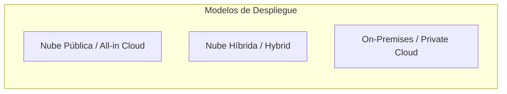

# Guía Técnica: Comparativa entre Infraestructura On-Premises y Computación en la Nube

---

## 1. Resumen Ejecutivo y Marco Comparativo

La toma de decisiones sobre la arquitectura de infraestructura tecnológica requiere ponderar las diferencias entre el modelo tradicional local (**On-premises**) y el modelo de **Computación en la Nube** (*Cloud Computing*), así como las estrategias intermedias de **Nube Híbrida** (*Hybrid Cloud*) (AWS, 2021; Mell & Grance, 2011).

Mientras que el esquema *On-premises* demanda la compra, custodia y administración física de la totalidad del hardware y software dentro de las instalaciones del cliente, la computación en la nube ofrece un consumo flexible de recursos bajo demanda provisto a través de Internet (AWS, 2021).

> **Cita textual en inglés (Fuente primaria):**  
> "A cloud-based application is fully deployed in the cloud and all parts of the application run in the cloud. Applications in the cloud have either been created in the cloud or have been migrated from an existing infrastructure to take advantage of the benefits of cloud computing. A hybrid deployment is a way to connect infrastructure and applications between cloud-based resources and existing resources that are not located in the cloud." (Amazon Web Services, 2021, p. 4).
> 
> **Traducción al español:**  
> "Una aplicación basada en la nube se encuentra totalmente desplegada en la nube y todas sus partes se ejecutan en ella. Las aplicaciones en la nube han sido creadas en la nube o bien migradas desde una infraestructura existente para aprovechar los beneficios de la computación en la nube. Un despliegue híbrido es una forma de conectar la infraestructura y las aplicaciones entre los recursos basados en la nube y los recursos existentes que no se encuentran ubicados en la nube."

> **Prompt de Diagrama Técnico:**  
> ```text
> Prompt: Hand-drawn technical network diagram, isolated on a transparent background (pure solid white for easy cutout), no whiteboard, no background elements. COLORING INSTRUCTION: Highlight ALL components with solid dark green and teal fill colors. Layout: Side-by-side comparison diagram. Left side: A physical data center boundary labeled "Centro de Datos On-Premises (CapEx)" containing physical server racks, power generators, and cooling units. Right side: A cloud boundary labeled "AWS Cloud (OpEx)" containing virtual compute instances (EC2), auto-scaling groups, and multi-region storage (S3). Draw a comparison balance scale in the center showing cost and operational flexibility. Simple line art, minimalist, Spanish text labels --ar 16:9
> ```

---

## 2. Cuadro Comparativo Multidimensional

| Dimensión Técnica y Financiera | Infraestructura Local (*On-Premises*) | Computación en la Nube (*AWS Cloud*) |
| :--- | :--- | :--- |
| **Estructura Financiera** | **Gasto de Capital (CapEx):** Altas inversiones iniciales en hardware, centros de datos, energía y licencias fijas (AWS, 2021). | **Gasto Operativo (OpEx):** Sin inversión inicial; esquema variable de pago por consumo real (*Pay-as-you-go*) (AWS, 2024a). |
| **Escalabilidad y Elasticidad** | **Lenta y rígida:** Requiere cotización, compra, recepción y configuración física de servidores (semanas/meses). | **Dinámica e instantánea:** Auto Scaling y provisión en minutos según la fluctuación de demanda (AWS, 2024b). |
| **Mantenimiento y Operaciones** | **Total responsabilidad interna:** Mantenimiento de hardware, cableado, climatización, parches y reemplazos físicos. | **Gestión delegada:** AWS asume la seguridad física, virtualización, energía y mantenimiento del hardware (AWS, 2023b). |
| **Disponibilidad y Resiliencia** | Requiere costosa duplicación de centros de datos para tolerancia a fallos. | Alta disponibilidad nativa multi-zona (*Multi-AZ*) y multi-región integrada (AWS, 2024b). |
| **Alcance y Despliegue Geográfico** | Limitado al alcance físico de los centros de datos corporativos. | Despliegue global en cuestión de minutos cercano a los usuarios finales (AWS, 2021). |
| **Gobernanza y Cumplimiento** | Control físico directo total sobre los activos y la residencia de datos. | Certificaciones internacionales de cumplimiento (SOC, ISO, HIPAA, PCI-DSS) gestionadas en AWS Artifact (AWS, 2023b). |

> **Prompt de Diagrama Técnico:**  
> ```text
> Prompt: Hand-drawn technical network diagram, isolated on a transparent background (pure solid white for easy cutout), no whiteboard, no background elements. COLORING INSTRUCTION: Highlight ALL components with solid dark green and teal fill colors. Layout: A dual-path timeline comparing resource provisioning. Top path labeled "Aprovisionamiento Tradicional On-Premises (3 a 6 Meses)" showing sequential blocks: "Cotización Hardware", "Aprobación Financiera CapEx", "Envío Físico", "Instalación en Rack", "Configuración de Red". Bottom path labeled "Aprovisionamiento en AWS Cloud (Minutos)" showing a single block: "Llamada API / Consola AWS -> Instancia Lista". Simple line art, minimalist, Spanish text labels --ar 16:9
> ```

---

## 3. Modelos de Despliegue en la Nube

De acuerdo con las definiciones de AWS (2021) y el estándar NIST SP 800-145 (Mell & Grance, 2011), se distinguen tres modelos de despliegue:



1. **Totalmente en la Nube (*Cloud-Native / All-in on AWS*):** La totalidad de los componentes de las aplicaciones y bases de datos residen y operan en la nube pública de AWS (AWS, 2021).
2. **Despliegue Híbrido (*Hybrid Deployment*):** Integra sistemas locales legados con recursos en la nube mediante conexiones dedicadas y seguras como **AWS Direct Connect**, **AWS Site-to-Site VPN** o extensiones locales como **AWS Outposts** y **AWS Storage Gateway** (AWS, 2021).
3. **Nube Privada / On-Premises (*Private Cloud*):** Infraestructura virtualizada dedicada exclusivamente a una única organización dentro de su propio perímetro físico (Mell & Grance, 2011).

> **Prompt de Diagrama Técnico:**  
> ```text
> Prompt: Hand-drawn technical network diagram, isolated on a transparent background (pure solid white for easy cutout), no whiteboard, no background elements. COLORING INSTRUCTION: Highlight ALL components with solid dark green and teal fill colors. Layout: A hybrid network topology. On the left, draw a rectangular container labeled "Red Corporativa On-Premises" with internal databases and private servers. In the center, draw TWO connection pipe links labeled "Enlace Dedicado (AWS Direct Connect)" and "Túnel Seguro (AWS Site-to-Site VPN)". On the right, draw a cloud container labeled "VPC en AWS Cloud" with public and private subnets, EC2 instances, and RDS databases. Simple line art, minimalist, Spanish text labels --ar 16:9
> ```

---

## 4. Casos de Estudio de Transformación y Adopción Empresarial

El impacto estratégico de migrar de entornos *On-premises* a AWS se evidencia en organizaciones de escala global (AWS, 2021):

- **Netflix:** Migración integral de sus centros de datos físicos a AWS para soportar picos masivos de transmisión de video a nivel mundial mediante el escalado dinámico de Amazon EC2 y almacenamiento masivo en Amazon S3.
- **Airbnb:** Gestión de millones de reservas y transacciones globales utilizando la infraestructura de bases de datos escalables de Amazon RDS y Amazon DynamoDB, eliminando la sobrecarga operativa de administración de servidores.
- **NASA Jet Propulsion Laboratory (JPL):** Procesamiento y análisis acelerado de terabytes de telemetría e imágenes satelitales procedentes de misiones espaciales mediante clústeres elásticos de cómputo en AWS (AWS, 2021).

---

## 5. Referencias Bibliográficas (Norma APA 7.ª Edición)

- Amazon Web Services. (2021). *Overview of Amazon Web Services: AWS Whitepaper*. AWS Documentation. https://docs.aws.amazon.com/whitepapers/latest/aws-overview/aws-overview.pdf
- Amazon Web Services. (2023). *AWS Certified Cloud Practitioner (CLF-C02) Exam Guide* (Version 2.0). AWS Training and Certification. https://d1.awsstatic.com/training-and-certification/docs-cloud-practitioner/AWS-Certified-Cloud-Practitioner_Exam-Guide.pdf
- Amazon Web Services. (2023b). *AWS Security Best Practices: AWS Whitepaper*. AWS Documentation. https://docs.aws.amazon.com/whitepapers/latest/aws-security-best-practices/aws-security-best-practices.pdf
- Amazon Web Services. (2024a). *How AWS Pricing Works: AWS Whitepaper*. AWS Documentation. https://docs.aws.amazon.com/whitepapers/latest/how-aws-pricing-works/how-aws-pricing-works.pdf
- Amazon Web Services. (2024b). *AWS Well-Architected Framework: Reliability Pillar*. AWS Whitepapers. https://docs.aws.amazon.com/wellarchitected/latest/reliability-pillar/welcome.html
- Mell, P., & Grance, T. (2011). *The NIST Definition of Cloud Computing* (Special Publication 800-145). National Institute of Standards and Technology. https://doi.org/10.6028/NIST.SP.800-145
