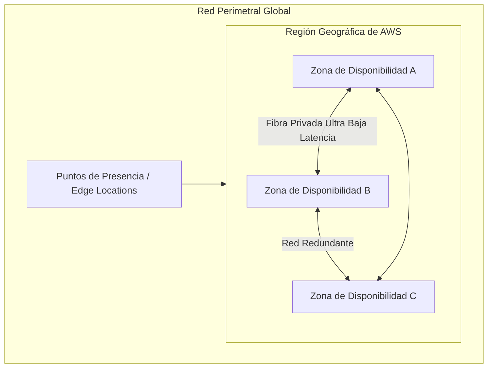

# Guía Técnica: ¿Qué es la Nube de Amazon Web Services (AWS)?

---

## 1. Resumen Ejecutivo y Evolución Histórica

**Amazon Web Services (AWS)** es la plataforma de computación en la nube más completa y adoptada a nivel global (AWS, 2021; Gartner, 2023). Ofrece más de 200 servicios integrales con todas las funciones de centros de datos en todo el mundo, operando bajo un modelo elástico bajo demanda con esquema de tarificación de pago por uso (*Pay-as-you-go*) (AWS, 2021; AWS, 2024a).

### Origen e Hitos Históricos
A principios de la década de 2000, Amazon.com identificó la necesidad de estructurar su infraestructura tecnológica interna para soportar el crecimiento vertiginoso de su plataforma de comercio electrónico. Esta arquitectura desacoplada y orientada a servicios sentó las bases para el lanzamiento público comercial de AWS en **2006** (AWS, 2021):
- **2004:** Lanzamiento del servicio pionero de mensajería desacoplada *Amazon Simple Queue Service* (Amazon SQS).
- **2006:** Lanzamiento oficial de *Amazon Simple Storage Service* (Amazon S3) y *Amazon Elastic Compute Cloud* (Amazon EC2), estableciendo la primera Región oficial en el Norte de Virginia (`us-east-1`).
- **2014:** Introducción del paradigma de computación sin servidor (*Serverless*) con *AWS Lambda* (AWS, 2021).

> **Cita textual en inglés (Fuente primaria):**  
> "In 2006, Amazon Web Services (AWS) began offering IT infrastructure services to businesses in the form of web services—now commonly known as cloud computing. One of the key benefits of cloud computing is the opportunity to replace upfront capital infrastructure expenses with low variable costs that scale with your business." (Amazon Web Services, 2021, p. 2).
> 
> **Traducción al español:**  
> "En 2006, Amazon Web Services (AWS) comenzó a ofrecer servicios de infraestructura de TI a las empresas en forma de servicios web, lo que hoy se conoce comúnmente como computación en la nube. Uno de los beneficios clave de la computación en la nube es la oportunidad de reemplazar los gastos de capital iniciales en infraestructura por costos variables bajos que escalan con su negocio."

> **Prompt de Diagrama Técnico (Estilo Fortinet Minimalista):**  
> ```text
> Prompt: Hand-drawn technical network diagram, isolated on a transparent background (pure solid white for easy cutout), no whiteboard, no background elements. COLORING INSTRUCTION: Highlight ALL components with solid dark green and teal fill colors. Layout: A horizontal timeline diagram showing the evolution of AWS. Node 1: "2004: Inicios con Amazon SQS (Mensajería Asíncrona)". Node 2: "2006: Lanzamiento Oficial con S3 y EC2 (Región us-east-1)". Node 3: "2014: Revolución Serverless con AWS Lambda". Node 4: "Presente: +200 Servicios Globales y Nube de IA Generativa". Connect all nodes with a thick directional horizontal line. Simple line art, Fortinet documentation style, minimalist, Spanish text labels --ar 16:9
> ```

---

## 2. Arquitectura de la Infraestructura Global de AWS

La plataforma de AWS se sustenta en una arquitectura distribuida geográficamente, diseñada para brindar redundancia, tolerancia a fallos y ultra baja latencia (AWS, 2021; AWS, 2024b):



### Componentes de la Infraestructura Global
1. **Región de AWS (*AWS Region*):** Una ubicación geográfica física en el mundo que contiene múltiples Zonas de Disponibilidad aisladas y separadas físicamente entre sí (AWS, 2021).
2. **Zona de Disponibilidad (*Availability Zone - AZ*):** Uno o más centros de datos discretos provistos de alimentación eléctrica redundante, refrigeración independiente y conectividad de red de fibra oscura de baja latencia dentro de una misma Región (AWS, 2024b).
3. **Puntos de Presencia (*Edge Locations & Regional Edge Caches*):** Red perimetral mundial empleada por servicios como Amazon CloudFront y AWS Route 53 para entregar contenido estático y dinámico con la menor latencia posible al usuario final (AWS, 2021).

> **Prompt de Diagrama Técnico (Estilo Fortinet Minimalista):**  
> ```text
> Prompt: Hand-drawn technical network diagram, isolated on a transparent background (pure solid white for easy cutout), no whiteboard, no background elements. COLORING INSTRUCTION: Highlight ALL components with solid dark green and teal fill colors. Layout: A large outer boundary labeled "Región de AWS (Ej. us-east-1)". Inside the boundary, draw THREE distinct square boxes labeled "Zona de Disponibilidad 1A (AZ-1A)", "Zona de Disponibilidad 1B (AZ-1B)", and "Zona de Disponibilidad 1C (AZ-1C)". Connect the three AZ boxes with a triangular bidirectional low-latency fiber network line labeled "Enlace Privado de Alta Velocidad (< 2ms)". Outside the region boundary, draw TWO small circles labeled "Punto de Presencia (Edge Location)" with directional lines to the AZs. Simple line art, Fortinet documentation style, minimalist, Spanish text labels --ar 16:9
> ```

---

## 3. Taxonomía de los Servicios Principales de AWS

La cartera de servicios de AWS abarca desde los bloques fundamentales de infraestructura hasta plataformas de vanguardia (AWS, 2021):

| Categoría de Servicio | Servicios Representativos | Propósito Técnico |
| :--- | :--- | :--- |
| **Cómputo (*Compute*)** | Amazon EC2, AWS Lambda, AWS Elastic Beanstalk, Amazon ECS, Amazon EKS | Suministro de capacidad de procesamiento virtualizado, contenedores y funciones sin servidor (AWS, 2021). |
| **Almacenamiento (*Storage*)** | Amazon S3, Amazon EBS, Amazon EFS, Amazon S3 Glacier | Almacenamiento de objetos escalable, volúmenes de bloques y sistemas de archivos compartidos (AWS, 2021). |
| **Bases de Datos (*Databases*)** | Amazon RDS, Amazon Aurora, Amazon DynamoDB, Amazon ElastiCache | Motores relacionales administrados (SQL), bases de datos NoSQL y almacenamiento en memoria (AWS, 2021). |
| **Redes (*Networking*)** | Amazon VPC, AWS Direct Connect, Amazon Route 53, Elastic Load Balancing | Segmentación de red privada virtual, resolución DNS y balanceo de carga (AWS, 2021). |
| **Inteligencia Artificial y ML** | Amazon SageMaker, Amazon Bedrock, Amazon Rekognition, Amazon Polly | Creación, entrenamiento y despliegue de modelos de Machine Learning e Inteligencia Artificial Generativa (AWS, 2021). |
| **Analítica y Big Data** | Amazon Athena, Amazon EMR, Amazon Redshift, Amazon QuickSight | Consultas SQL serverless, procesamiento distribuido y almacenes de datos a escala de petabytes (AWS, 2021). |

> **Prompt de Diagrama Técnico (Estilo Fortinet Minimalista):**  
> ```text
> Prompt: Hand-drawn technical network diagram, isolated on a transparent background (pure solid white for easy cutout), no whiteboard, no background elements. COLORING INSTRUCTION: Highlight ALL components with solid dark green and teal fill colors. Layout: A hierarchical service taxonomy chart. Central header block labeled "Ecosistema de Servicios Principales de AWS". Branching into SIX structured service blocks: Block 1 "Cómputo (EC2, Lambda)", Block 2 "Almacenamiento (S3, EBS)", Block 3 "Bases de Datos (RDS, DynamoDB)", Block 4 "Redes (VPC, Route 53)", Block 5 "Seguridad & IAM (KMS, Shield)", Block 6 "IA & ML (SageMaker, Bedrock)". Simple line art, Fortinet documentation style, minimalist, Spanish text labels --ar 16:9
> ```

---

## 4. Liderazgo en el Mercado y Validación de la Industria

Informes de firmas de analistas de la industria como Gartner posicionan de manera continua a Amazon Web Services en el cuadrante de líderes en plataformas estratégicas de servicios en la nube (*Strategic Cloud Platform Services*), destacando su amplitud de visión y capacidad de ejecución operativa (Gartner, 2023).

> **Cita textual en inglés (Fuente primaria):**  
> "AWS continues to be evaluated as a Leader in the Gartner Magic Quadrant for Strategic Cloud Platform Services, reflecting its continued innovation, deep service portfolio, and massive global customer ecosystem across every industry sector." (Gartner, 2023, p. 5).
> 
> **Traducción al español:**  
> "AWS continúa siendo evaluado como Líder en el Cuadrante Mágico de Gartner para Servicios de Plataformas Estratégicas en la Nube, lo que refleja su continua innovación, su profundo portafolio de servicios y su masivo ecosistema global de clientes en todos los sectores industriales."

---

## 5. Referencias Bibliográficas (Norma APA 7.ª Edición)

- Amazon Web Services. (2021). *Overview of Amazon Web Services: AWS Whitepaper*. AWS Documentation. https://docs.aws.amazon.com/whitepapers/latest/aws-overview/aws-overview.pdf
- Amazon Web Services. (2023). *AWS Certified Cloud Practitioner (CLF-C02) Exam Guide* (Version 2.0). AWS Training and Certification. https://d1.awsstatic.com/training-and-certification/docs-cloud-practitioner/AWS-Certified-Cloud-Practitioner_Exam-Guide.pdf
- Amazon Web Services. (2024a). *How AWS Pricing Works: AWS Whitepaper*. AWS Documentation. https://docs.aws.amazon.com/whitepapers/latest/how-aws-pricing-works/how-aws-pricing-works.pdf
- Amazon Web Services. (2024b). *AWS Well-Architected Framework: Reliability Pillar*. AWS Whitepapers. https://docs.aws.amazon.com/wellarchitected/latest/reliability-pillar/welcome.html
- Gartner. (2023). *Magic Quadrant for Strategic Cloud Platform Services*. Gartner Research. https://www.gartner.com
