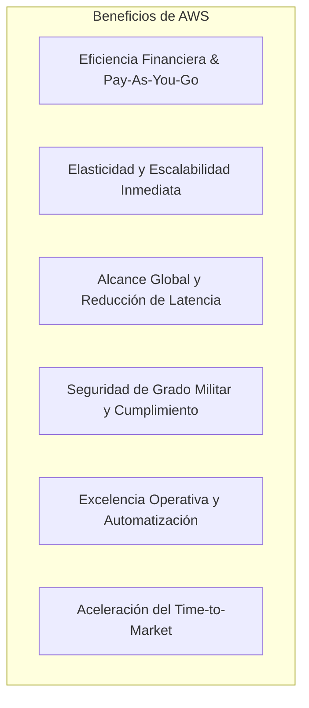

# Guía Técnica: Beneficios Estratégicos y Arquitectónicos de AWS Cloud

---

## 1. Resumen Ejecutivo

La adopción de **Amazon Web Services (AWS)** trasciende el mero ahorro financiero, transformándose en un habilitador estratégico que optimiza la agilidad, la seguridad y la resiliencia operativa empresarial (AWS, 2021; AWS, 2024b). Mediante un portafolio holístico de servicios de infraestructura, bases de datos, redes y tecnologías avanzadas, AWS permite sustituir la rigidez operativa tradicional por un entorno altamente elástico y automatizado (AWS, 2021).

> **Cita textual en inglés (Fuente primaria):**  
> "AWS provides a highly reliable, scalable, low-cost infrastructure platform in the cloud that powers hundreds of thousands of businesses in 190 countries around the world. With AWS, you can take advantage of the latest technological innovations without the need to invest in costly hardware or data center infrastructure." (Amazon Web Services, 2021, p. 2).
> 
> **Traducción al español:**  
> "AWS proporciona una plataforma de infraestructura en la nube altamente confiable, escalable y de bajo costo que impulsa a cientos de miles de empresas en 190 países de todo el mundo. Con AWS, usted puede aprovechar las últimas innovaciones tecnológicas sin necesidad de invertir en costosa infraestructura de centros de datos o hardware."

> **Prompt de Diagrama Técnico:**  
> ```text
> Prompt: Hand-drawn technical network diagram, isolated on a transparent background (pure solid white for easy cutout), no whiteboard, no background elements. COLORING INSTRUCTION: Highlight ALL components with solid dark green and teal fill colors. Layout: A large central hub labeled "Propuesta de Valor Estratégica de AWS Cloud". Radiating from the hub, draw SIX interconnected circular gear nodes labeled: "1. Reducción de Costes (Pay-as-you-go)", "2. Escalabilidad & Elasticidad", "3. Alcance Global", "4. Seguridad de Nivel Empresarial", "5. Innovación Continua", and "6. Agilidad Operativa". Simple line art, minimalist, Spanish text labels --ar 16:9
> ```

---

## 2. Taxonomía de Beneficios Fundamentales de AWS



### 2.1. Eficiencia Financiera y Modelo de Pago por Uso (*Pay-as-you-go*)
Se elimina la necesidad de compromisos de capital a largo plazo (*CapEx*). Las organizaciones abonan exclusivamente por los segundos, horas o gigabytes consumidos (*OpEx*), optimizando el rendimiento sobre la inversión tecnológica (AWS, 2024a).

### 2.2. Escalabilidad y Elasticidad
La arquitectura elástica permite aprovisionar dinámicamente recursos computacionales hacia arriba (*Scale-up*) o hacia afuera (*Scale-out*) durante periodos de alta demanda, y reducirlos (*Scale-in*) cuando el tráfico disminuye, evitando la infrautilización (AWS, 2024b).

### 2.3. Cobertura Global y Alta Disponibilidad
A través del despliegue en múltiples Regiones y Zonas de Disponibilidad (*Multi-AZ*), se mitiga el riesgo de caídas del servicio y se minimiza la latencia para usuarios finales distribuidos en cualquier parte del mundo (AWS, 2021; AWS, 2024b).

### 2.4. Seguridad Rigurosa y Cumplimiento Normativo
AWS incorpora cifrado en tránsito y en reposo, aislamiento de redes mediante Amazon VPC y gestión granular de privilegios a través de AWS Identity and Access Management (IAM), cumpliendo con certificaciones rigurosas como ISO 27001, SOC 1/2/3, PCI DSS y HIPAA (AWS, 2023b).

> **Cita textual en inglés (Fuente primaria):**  
> "Cloud security at AWS is the highest priority. As an AWS customer, you benefit from a data center and network architecture built to meet the requirements of the most security-sensitive organizations. Security in the cloud is much like security in your on-premises data centers—only without the costs of maintaining facilities and hardware." (Amazon Web Services, 2023b, p. 2).
> 
> **Traducción al español:**  
> "La seguridad en la nube en AWS es la máxima prioridad. Como cliente de AWS, usted se beneficia de una arquitectura de red y centros de datos construida para satisfacer los requisitos de las organizaciones más sensibles a la seguridad. La seguridad en la nube es muy similar a la seguridad en sus centros de datos locales, solo que sin los costos de mantenimiento de instalaciones y hardware."

### 2.5. Excelencia Operativa y Automatización
Herramientas de Infraestructura como Código (IaC) como **AWS CloudFormation** y plataformas de orquestación como **AWS Elastic Beanstalk** automatizan los ciclos de vida de aprovisionamiento, despliegue y monitoreo continuo (AWS, 2024b).

### 2.6. Aceleración de la Innovación y Salida al Mercado (*Time-to-Market*)
La capacidad de generar entornos de prueba en minutos permite experimentar ágilmente con tecnologías emergentes como Inteligencia Artificial (Amazon SageMaker, Amazon Bedrock), Internet de las Cosas (AWS IoT) y arquitecturas Serverless (AWS Lambda) (AWS, 2021).

> **Prompt de Diagrama Técnico:**  
> ```text
> Prompt: Hand-drawn technical network diagram, isolated on a transparent background (pure solid white for easy cutout), no whiteboard, no background elements. COLORING INSTRUCTION: Highlight ALL components with solid dark green and teal fill colors. Layout: An elasticity and auto-scaling technical graph. Horizontal axis: "Tiempo (Horas del Día)". Vertical axis: "Tráfico de Usuarios y Recursos". Draw a dashed wave curve labeled "Demanda de Carga Real". Surrounding the curve, draw stacked rectangular instance blocks labeled "Instancias EC2 Aprovisionadas Dinámicamente". Show dynamic scale-out during peak and scale-in during valley, labeled "Cero Capacidad Desperdiciada". Simple line art, minimalist, Spanish text labels --ar 16:9
> ```

---

## 3. Matriz de Casos de Éxito Empresarial

| Organización | Desafío Operativo | Solución Implementada en AWS | Beneficio Cuantificable |
| :--- | :--- | :--- | :--- |
| **Netflix** | Demanda masiva y volátil de transmisión de video a nivel global. | Arquitectura elástica basada en Amazon EC2, Amazon S3 y Auto Scaling en múltiples Regiones (AWS, 2021). | Escalado automático ante picos masivos de visualización y optimización continua de costos por consumo (AWS, 2024a). |
| **Airbnb** | Crecimiento exponencial en la gestión de reservas y transacciones entre anfitriones y huéspedes. | Bases de datos relacionales y NoSQL administradas (Amazon RDS, Amazon DynamoDB) y distribución vía Amazon CloudFront. | Disponibilidad del 99.99%, latencia mínima y delegación total de la administración de base de datos a AWS (AWS, 2021). |
| **Lyft** | Variabilidad extrema en la demanda de viajes compartidos en tiempo real según la hora y la ciudad. | Procesamiento elástico de datos y enrutamiento dinámico en Amazon EC2 y AWS Lambda. | Capacidad para responder inmediatamente a incrementos de tráfico imprevistos reduciendo la infraestructura ociosa (AWS, 2024b). |

> **Prompt de Diagrama Técnico:**  
> ```text
> Prompt: Hand-drawn technical network diagram, isolated on a transparent background (pure solid white for easy cutout), no whiteboard, no background elements. COLORING INSTRUCTION: Highlight ALL components with solid dark green and teal fill colors. Layout: Three parallel enterprise architecture pipelines. Top pipeline labeled "Netflix: Transmisión Global Elástica (EC2 + S3 + CloudFront)". Middle pipeline labeled "Airbnb: Plataforma de Reservas de Alta Disponibilidad (RDS Multi-AZ + DynamoDB)". Bottom pipeline labeled "Lyft: Procesamiento en Tiempo Real de Viajes (Lambda Serverless + Kinesis)". All three flow into a unified outcome block labeled "Escalabilidad Global y Optimización de Costos". Simple line art, minimalist, Spanish text labels --ar 16:9
> ```

---

## 4. Referencias Bibliográficas (Norma APA 7.ª Edición)

- Amazon Web Services. (2021). *Overview of Amazon Web Services: AWS Whitepaper*. AWS Documentation. https://docs.aws.amazon.com/whitepapers/latest/aws-overview/aws-overview.pdf
- Amazon Web Services. (2023). *AWS Certified Cloud Practitioner (CLF-C02) Exam Guide* (Version 2.0). AWS Training and Certification. https://d1.awsstatic.com/training-and-certification/docs-cloud-practitioner/AWS-Certified-Cloud-Practitioner_Exam-Guide.pdf
- Amazon Web Services. (2023b). *AWS Security Best Practices: AWS Whitepaper*. AWS Documentation. https://docs.aws.amazon.com/whitepapers/latest/aws-security-best-practices/aws-security-best-practices.pdf
- Amazon Web Services. (2024a). *How AWS Pricing Works: AWS Whitepaper*. AWS Documentation. https://docs.aws.amazon.com/whitepapers/latest/how-aws-pricing-works/how-aws-pricing-works.pdf
- Amazon Web Services. (2024b). *AWS Well-Architected Framework: Reliability Pillar*. AWS Whitepapers. https://docs.aws.amazon.com/wellarchitected/latest/reliability-pillar/welcome.html
