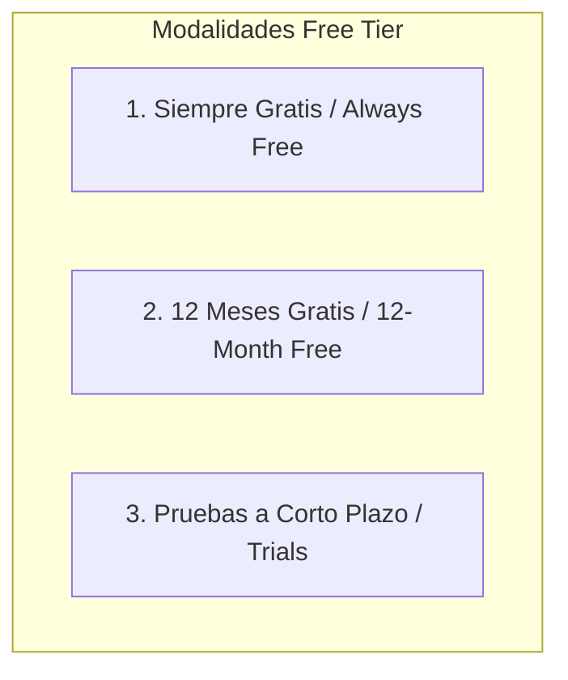
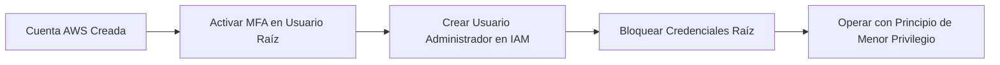

# Guía Técnica: Creación y Configuración de la Cuenta de Capa Gratuita de AWS (AWS Free Tier)

---

## 1. Resumen Ejecutivo y Tipología de Ofertas de la Capa Gratuita

El programa **AWS Free Tier** (Capa Gratuita de AWS) permite a los nuevos usuarios, desarrolladores e investigadores explorar y evaluar más de 100 servicios de Amazon Web Services sin incurrir en costos directos, sujeto a límites específicos de uso y tiempo (AWS, 2024a).

Amazon Web Services (2024a) estructura la Capa Gratuita en tres modalidades diferenciadas:



### 1.1. Tipología de Ofertas Oficiales

| Tipo de Oferta | Descripción y Alcance Temporal | Servicios y Límites Representativos |
| :--- | :--- | :--- |
| **Siempre Gratis (*Always Free*)** | Disponible para todos los clientes de AWS por tiempo indefinido, independientemente de la antigüedad de la cuenta. | - **AWS Lambda:** 1.000.000 de solicitudes gratuitas al mes.<br>- **Amazon DynamoDB:** 25 GB de almacenamiento y hasta 200 millones de peticiones al mes.<br>- **Amazon SNS:** 1.000.000 de publicaciones al mes (AWS, 2024a). |
| **12 Meses Gratis (*12 Months Free*)** | Activa durante los primeros 12 meses naturales a partir de la fecha de registro de la cuenta de AWS. | - **Amazon EC2:** 750 horas mensuales de instancias `t2.micro` o `t3.micro`.<br>- **Amazon S3:** 5 GB de almacenamiento estándar con 20.000 solicitudes `GET` y 2.000 `PUT`.<br>- **Amazon RDS:** 750 horas mensuales de bases de datos `db.t2.micro`, `db.t3.micro` o `db.t4g.micro` (AWS, 2024a). |
| **Pruebas a Corto Plazo (*Trials*)** | Periodos promocionales de evaluación que se activan al utilizar un servicio por primera vez. | - **Amazon SageMaker:** 2 meses de prueba gratuita.<br>- **Amazon Redshift:** 2 meses con 750 horas de nodo `DC2.Large`.<br>- **Amazon Lightsail:** 3 meses de prueba (AWS, 2024a). |

> **Cita textual en inglés (Fuente primaria):**  
> "The AWS Free Tier provides customers the ability to explore and try out AWS services free of charge up to specified limits for each service. The Free Tier is comprised of three different types of offerings: always free, 12 months free, and short-term trials." (Amazon Web Services, 2024a, p. 2).
> 
> **Traducción al español:**  
> "La Capa Gratuita de AWS proporciona a los clientes la capacidad de explorar y probar los servicios de AWS sin costo hasta límites especificados para cada servicio. La Capa Gratuita consta de tres tipos diferentes de ofertas: siempre gratis, 12 meses gratis y pruebas a corto plazo."

> **Prompt de Diagrama Técnico:**  
> ```text
> Prompt: Hand-drawn technical network diagram, isolated on a transparent background (pure solid white for easy cutout), no whiteboard, no background elements. COLORING INSTRUCTION: Highlight ALL components with solid dark green and teal fill colors. Layout: Three side-by-side vertical pillar boxes labeled "Ofertas de AWS Free Tier". Pillar 1: "Siempre Gratis (Always Free)" with Lambda and DynamoDB icons. Pillar 2: "12 Meses Gratis" with EC2 (750h/mes) and S3 (5GB) icons. Pillar 3: "Pruebas a Corto Plazo (Trials)" with SageMaker and Redshift icons. Connect a central user wallet icon to all three pillars with horizontal dashed arrows labeled "Cero Coste Dentro de Límites". Simple line art, minimalist, Spanish text labels --ar 16:9
> ```

---

## 2. Proceso de Registro y Activación de la Cuenta

El procedimiento formal de creación de una cuenta en AWS consta de cinco fases obligatorias:

1. **Credenciales del Usuario Raíz (*Root User*):** Registro de correo electrónico corporativo o personal, nombre único de la cuenta de AWS y definición de una contraseña de alta complejidad (AWS, 2023b).
2. **Información de Contacto:** Selección del tipo de uso (*Personal* o *Profesional*), ingreso de nombre completo, teléfono, dirección física y aceptación del Contrato de Cliente de AWS.
3. **Verificación de Facturación (*Billing Information*):** Registro de una tarjeta de crédito o débito válida. Aunque la Capa Gratuita es sin costo, AWS requiere un método de pago para validar la identidad y tarificar los consumos que excedan los límites permitidos (AWS, 2024a).
4. **Validación de Identidad:** Verificación telefónica automatizada mediante código enviado por SMS o llamada de voz.
5. **Selección del Plan de Soporte:** Selección del plan **AWS Basic Support** (incluido sin costo) y finalización del registro (AWS, 2023).

---

## 3. Mejores Prácticas de Seguridad para el Usuario Raíz (Requerimiento CLF-C02)

La protección de la cuenta recién aprovisionada constituye uno de los tópicos evaluativos más críticos del examen CLF-C02 (AWS, 2023; AWS, 2023b):



### Reglas Cardinales de Gobernanza y Seguridad:
1. **Activar Autenticación Multifactor (*MFA*):** Es imperativo habilitar MFA (aplicación virtual, llave FIDO o hardware) inmediatamente en la cuenta del usuario raíz (AWS, 2023b).
2. **No utilizar el Usuario Raíz para Tareas Diarias:** El usuario raíz posee acceso irrestricto a todos los recursos y opciones de facturación. No debe emplearse para labores administrativas habituales ni desarrollo operativo (AWS, 2023b).
3. **Creación de Usuarios en AWS IAM / IAM Identity Center:** Se debe aprovisionar un usuario o rol en AWS Identity and Access Management con permisos administrativos delegados para la gestión continua del entorno (AWS, 2023b).
4. **Configuración de Alertas de Presupuesto (*AWS Budgets*):** Se aconseja habilitar una alarma de costo cero en AWS Budgets para recibir notificaciones automáticas en caso de que el consumo se aproxime o supere el umbral de la Capa Gratuita (AWS, 2024a).

> **Cita textual en inglés (Fuente primaria):**  
> "The root user identity is the first identity created when you set up an AWS account. It has complete access to all AWS services and resources in the account. We strongly recommend that you do not use the root user for your everyday tasks, even the administrative ones. Instead, adhere to the best practice of using the root user only to create your first IAM admin user and then lock away the root user credentials." (Amazon Web Services, 2023b, p. 5).
> 
> **Traducción al español:**  
> "La identidad del usuario raíz es la primera identidad creada cuando se configura una cuenta de AWS. Posee acceso completo a todos los servicios y recursos de AWS en la cuenta. Recomendamos encarecidamente que no utilice el usuario raíz para sus tareas diarias, ni siquiera para las administrativas. En su lugar, adhiérase a la mejor práctica de utilizar el usuario raíz únicamente para crear su primer usuario administrador de IAM y luego resguarde bajo llave las credenciales del usuario raíz."

> **Prompt de Diagrama Técnico:**  
> ```text
> Prompt: Hand-drawn technical network diagram, isolated on a transparent background (pure solid white for easy cutout), no whiteboard, no background elements. COLORING INSTRUCTION: Highlight ALL components with solid dark green and teal fill colors. Layout: A security workflow diagram. Left block: A lockbox container labeled "Usuario Raíz (Root User)" with an MFA shield icon and a warning label "Uso Exclusivo: Tareas Iniciales y Resguardo Seguro". Right block: A user container labeled "Usuario Administrador IAM" with sub-blocks "Operaciones Diarias", "Despliegue de Infraestructura", and "Monitoreo". Solid arrow connecting root user creating the IAM administrator. Simple line art, minimalist, Spanish text labels --ar 16:9
> ```

---

## 4. Referencias Bibliográficas (Norma APA 7.ª Edición)

- Amazon Web Services. (2021). *Overview of Amazon Web Services: AWS Whitepaper*. AWS Documentation. https://docs.aws.amazon.com/whitepapers/latest/aws-overview/aws-overview.pdf
- Amazon Web Services. (2023). *AWS Certified Cloud Practitioner (CLF-C02) Exam Guide* (Version 2.0). AWS Training and Certification. https://d1.awsstatic.com/training-and-certification/docs-cloud-practitioner/AWS-Certified-Cloud-Practitioner_Exam-Guide.pdf
- Amazon Web Services. (2023b). *AWS Security Best Practices: AWS Whitepaper*. AWS Documentation. https://docs.aws.amazon.com/whitepapers/latest/aws-security-best-practices/aws-security-best-practices.pdf
- Amazon Web Services. (2024a). *AWS Free Tier FAQs and Service Limits*. AWS Documentation. https://aws.amazon.com/free/free-tier-faqs/
- Amazon Web Services. (2024b). *AWS Identity and Access Management User Guide*. AWS Documentation. https://docs.aws.amazon.com/IAM/latest/UserGuide/introduction.html
