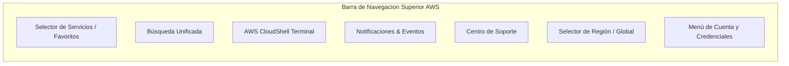

# Guía Técnica: Navegación y Estructura de la Consola de Administración de AWS (AWS Management Console)

---

## 1. Resumen Ejecutivo y Propósito de la Consola

La **Consola de Administración de AWS** (*AWS Management Console*) es una aplicación web interactiva y centralizada que permite a los profesionales de TI, arquitectos y administradores aprovisionar, monitorear y gestionar el catálogo completo de recursos de Amazon Web Services a través de una interfaz gráfica intuitiva (AWS, 2021; AWS, 2024b).

Adicionalmente a la consola gráfica, AWS proporciona interfaces programáticas y de línea de comandos como la **AWS Command Line Interface (AWS CLI)** y los **Software Development Kits (AWS SDKs)**, complementados directamente dentro del navegador mediante **AWS CloudShell** (AWS, 2024d).

> **Cita textual en inglés (Fuente primaria):**  
> "The AWS Management Console is a web-based interface for accessing and managing Amazon Web Services. The Console Home page provides access to a growing collection of widgets that display important information about your AWS environment, allowing you to access services, view bills, check the health of your resources, and customize your working environment." (Amazon Web Services, 2024b, p. 1).
> 
> **Traducción al español:**  
> "La Consola de Administración de AWS es una interfaz basada en web para acceder y administrar los servicios de Amazon Web Services. La página de Inicio de la Consola proporciona acceso a una colección creciente de widgets que muestran información importante sobre su entorno de AWS, permitiéndole acceder a servicios, consultar facturas, verificar el estado de sus recursos y personalizar su entorno de trabajo."

> **Prompt de Diagrama Técnico (Estilo Fortinet Minimalista):**  
> ```text
> Prompt: Hand-drawn technical network diagram, isolated on a transparent background (pure solid white for easy cutout), no whiteboard, no background elements. COLORING INSTRUCTION: Highlight ALL components with solid dark green and teal fill colors. Layout: A wide architectural mockup of the "AWS Management Console Header & Navigation Bar". From left to right along the top bar: [AWS Logo / Home], [Selector de Servicios], [Caja de Búsqueda Global], [Icono AWS CloudShell], [Centro de Notificaciones], [Menú de Soporte], [Selector de Regiones (ej. us-east-1)], and [Menú de Cuenta & IAM]. Simple line art, Fortinet documentation style, minimalist, Spanish text labels --ar 16:9
> ```

---

## 2. Anatomía de la Barra de Navegación Superior

La barra de navegación superior constituye el eje de control transversal de la sesión operativa (AWS, 2024b):



### 2.1. Controles y Funcionalidades Principales

| Control de Navegación | Propósito Operativo | Servicios y Vínculos Asociados |
| :--- | :--- | :--- |
| **Selector de Servicios (*Services*)** | Exploración taxonómica de los más de 200 servicios agrupados por categoría (Cómputo, Almacenamiento, Bases de Datos, etc.) y anclaje de favoritos mediante el icono de estrella (AWS, 2021). | Todos los servicios de AWS. |
| **Búsqueda Global (*Search Bar*)** | Motor de indexación instantánea para localizar recursos desplegados, servicios, documentación oficial, blogs técnicos y productos de AWS Marketplace (AWS, 2024b). | Búsqueda unificada en toda la cuenta. |
| **AWS CloudShell** | Entorno de terminal basada en navegador, pre-autenticado con las credenciales de la sesión activa, equipado con AWS CLI, AWS CDK, Python y Node.js, y con 1 GB de almacenamiento persistente por Región (AWS, 2024d). | Herramientas de scripting y administración CLI. |
| **Centro de Notificaciones (*Notifications*)** | Visualización centralizada de alertas operativas, eventos de salud del sistema y notificaciones configuradas por el usuario (AWS, 2024b). | AWS User Notifications. |
| **Menú de Soporte (*Support Menu*)** | Acceso al Centro de Soporte para apertura y seguimiento de casos técnicos, foros de AWS re:Post, documentación oficial y contacto directo (AWS, 2024c). | AWS Support Center. |
| **Selector de Región (*Region Selector*)** | Cambio dinámico de la Región geográfica activa (ej. `us-east-1`, `eu-west-1`) o visualización de estado *Global* para servicios no regionales como AWS IAM, Amazon CloudFront y Amazon Route 53 (AWS, 2021). | Infraestructura Global de AWS. |
| **Menú de Cuenta e Identidad (*Account Menu*)** | Consulta del Account ID (12 dígitos), usuario IAM o rol activo, acceso al Billing Dashboard, credenciales de seguridad, gestión multi-cuenta mediante AWS Organizations y Service Quotas (AWS, 2024a; AWS, 2024b). | IAM, AWS Organizations, Facturación. |

---

## 3. Panel de Inicio Personalizable y Ecosistema de Widgets

La página principal de la consola (*Console Home*) permite organizar widgets dinámicos para supervisar la salud y finanzas del entorno en tiempo real (AWS, 2024b):

1. **AWS Health Dashboard:** Notifica incidentes o mantenimientos programados que puedan impactar la infraestructura física o los servicios activos en la cuenta del cliente (AWS, 2024b).
2. **AWS Trusted Advisor:** Herramienta de optimización automatizada que inspecciona el entorno en función de las mejores prácticas de AWS a través de cinco pilares: optimización de costos, rendimiento, seguridad, tolerancia a fallos y límites de servicio (*Service Quotas*) (AWS, 2024c).
3. **Costo y Uso (*Cost & Usage Widget*):** Muestra el resumen del gasto mensual acumulado, un desglose por servicios principales y la proyección estimada para el cierre del ciclo de facturación (AWS, 2024a).
4. **Servicios Visitados Recientemente y Favoritos:** Acceso directo a las consolas de servicio empleadas con mayor frecuencia.
5. **Límites de Servicio (*Service Quotas*):** Permite verificar la proximidad a los límites por defecto asignados a la cuenta (ej. número de Elastic IPs, instancias EC2 por tipo) y solicitar incrementos formalmente mediante tickets (AWS, 2024b).

> **Cita textual en inglés (Fuente primaria):**  
> "AWS Trusted Advisor is an online tool that provides you real time guidance to help you provision your resources following AWS best practices. Trusted Advisor checks help optimize your AWS infrastructure, increase security and performance, reduce your overall costs, and monitor service quotas." (Amazon Web Services, 2024c, p. 2).
> 
> **Traducción al español:**  
> "AWS Trusted Advisor es una herramienta en línea que le proporciona orientación en tiempo real para ayudarle a aprovisionar sus recursos siguiendo las mejores prácticas de AWS. Las comprobaciones de Trusted Advisor ayudan a optimizar su infraestructura de AWS, aumentar la seguridad y el rendimiento, reducir sus costos generales y supervisar las cuotas de servicio."

> **Prompt de Diagrama Técnico (Estilo Fortinet Minimalista):**  
> ```text
> Prompt: Hand-drawn technical network diagram, isolated on a transparent background (pure solid white for easy cutout), no whiteboard, no background elements. COLORING INSTRUCTION: Highlight ALL components with solid dark green and teal fill colors. Layout: A dashboard grid showing the "Página de Inicio de la Consola de AWS (Widgets Dinámicos)". Widget 1 (Top-Left): "AWS Health Dashboard (Estado Operativo)". Widget 2 (Top-Right): "AWS Trusted Advisor (5 Pilares de Mejores Prácticas)". Widget 3 (Bottom-Left): "Resumen de Costos y Facturación (Gasto Mensual y Proyección)". Widget 4 (Bottom-Right): "Servicios Favoritos y Recientes (EC2, S3, RDS, VPC)". Simple line art, Fortinet documentation style, minimalist, Spanish text labels --ar 16:9
> ```

---

## 4. Referencias Bibliográficas (Norma APA 7.ª Edición)

- Amazon Web Services. (2021). *Overview of Amazon Web Services: AWS Whitepaper*. AWS Documentation. https://docs.aws.amazon.com/whitepapers/latest/aws-overview/aws-overview.pdf
- Amazon Web Services. (2023). *AWS Certified Cloud Practitioner (CLF-C02) Exam Guide* (Version 2.0). AWS Training and Certification. https://d1.awsstatic.com/training-and-certification/docs-cloud-practitioner/AWS-Certified-Cloud-Practitioner_Exam-Guide.pdf
- Amazon Web Services. (2024a). *How AWS Pricing Works: AWS Whitepaper*. AWS Documentation. https://docs.aws.amazon.com/whitepapers/latest/how-aws-pricing-works/how-aws-pricing-works.pdf
- Amazon Web Services. (2024b). *AWS Management Console User Guide*. AWS Documentation. https://docs.aws.amazon.com/awsconsolehelpdocs/latest/gsg/what-is.html
- Amazon Web Services. (2024c). *AWS Trusted Advisor User Guide*. AWS Documentation. https://docs.aws.amazon.com/awssupport/latest/user/trusted-advisor.html
- Amazon Web Services. (2024d). *AWS CloudShell User Guide*. AWS Documentation. https://docs.aws.amazon.com/cloudshell/latest/userguide/welcome.html
