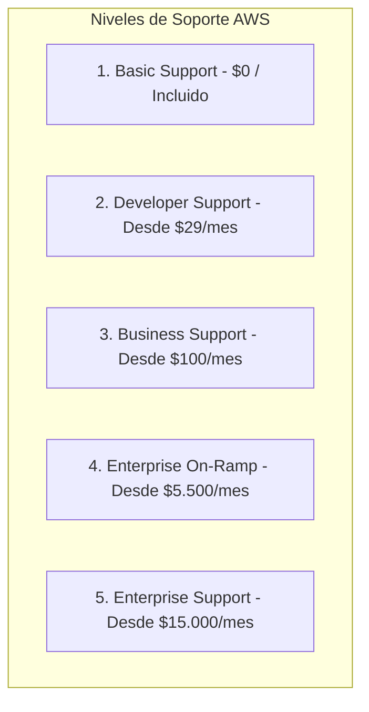
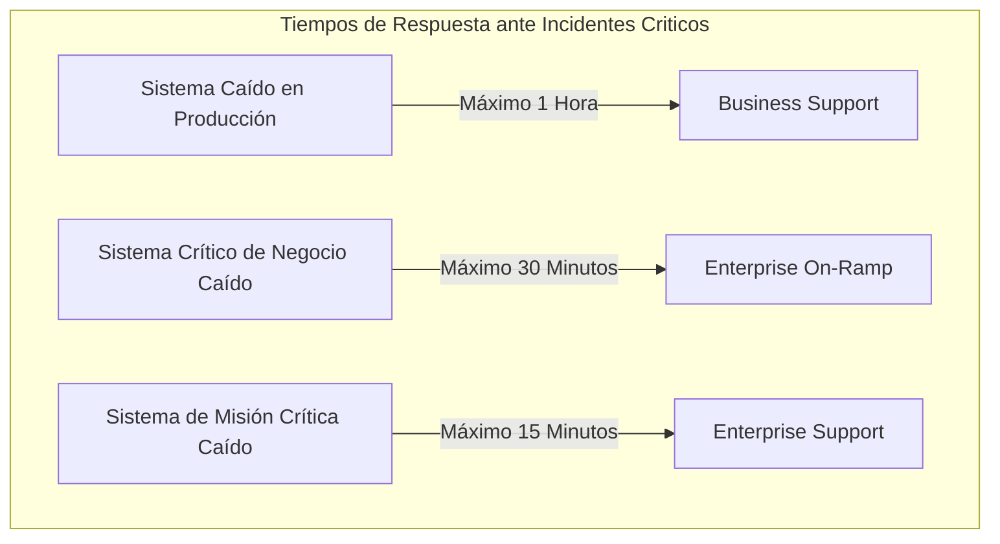

# Guía Técnica: Comparativa y Estructura de los Planes de Soporte de AWS (AWS Support Plans)

---

## 1. Resumen Ejecutivo y Clasificación de Planes

Amazon Web Services ofrece cinco niveles de planes de soporte técnico y operativo diseñados para responder a las diversas escalas de adopción, desde experimentación individual y entornos de desarrollo hasta arquitecturas de misión crítica a escala empresarial (AWS, 2023; AWS, 2024a):



> **Cita textual en inglés (Fuente primaria):**  
> "AWS Support offers a range of plans that provide access to tools and expertise that support the success and operational health of your AWS solutions. All support plans provide 24/7 access to customer service, AWS documentation, whitepapers, and support forums. For technical support and additional capabilities, customers can choose between Developer, Business, Enterprise On-Ramp, and Enterprise Support." (Amazon Web Services, 2024e, p. 1).
> 
> **Traducción al español:**  
> "AWS Support ofrece una gama de planes que proporcionan acceso a herramientas y experiencia técnica para respaldar el éxito y la salud operativa de sus soluciones de AWS. Todos los planes de soporte brindan acceso 24/7 a atención al cliente, documentación de AWS, informes técnicos (whitepapers) y foros de soporte. Para soporte técnico y capacidades adicionales, los clientes pueden elegir entre Developer, Business, Enterprise On-Ramp y Enterprise Support."

> **Prompt de Diagrama Técnico (Estilo Fortinet Minimalista):**  
> ```text
> Prompt: Hand-drawn technical network diagram, isolated on a transparent background (pure solid white for easy cutout), no whiteboard, no background elements. COLORING INSTRUCTION: Highlight ALL components with solid dark green and teal fill colors. Layout: A horizontal tiered ladder showing the FIVE AWS Support Plans ascending from left to right: Step 1 "Basic ($0 - Pruebas y Sandbox)", Step 2 "Developer ($29/mes - Cargas No Críticas)", Step 3 "Business ($100/mes - Producción 24/7)", Step 4 "Enterprise On-Ramp ($5.500/mes - Asistencia Consultiva)", Step 5 "Enterprise ($15.000/mes - TAM Dedicado y SLA 15 min)". Connect each tier with directional escalation arrows. Simple line art, Fortinet documentation style, minimalist, Spanish text labels --ar 16:9
> ```

---

## 2. Matriz Comparativa Integral de Capacidades Técnicas

En la evaluación de la certificación AWS Certified Cloud Practitioner (CLF-C02), el Dominio 4 exige distinguir con precisión los tiempos de respuesta ante incidentes (*SLAs*), la asignación del Gerente Técnico de Cuenta (*Technical Account Manager - TAM*) y el acceso a las comprobaciones de **AWS Trusted Advisor** (AWS, 2023; AWS, 2024e):

| Característica / Plan | Basic Support | Developer Support | Business Support | Enterprise On-Ramp | Enterprise Support |
| :--- | :---: | :---: | :---: | :---: | :---: |
| **Costo Base Mensual** | **$0** (Incluido) | Mayor entre **$29** o 3% del gasto mensual | Mayor entre **$100** o 10% del gasto (escala decreciente) | Mayor entre **$5.500** o 10% del gasto mensual | Mayor entre **$15.000** o 10% del gasto (escala decreciente) |
| **Público / Entorno Recomendado** | Evaluación, aprendizaje y sandbox | Experimentación y cargas de trabajo de desarrollo | Cargas de trabajo en **Producción** | Cargas de producción y críticas de negocio | Cargas de **Misión Crítica** a escala empresarial |
| **Asignación de TAM (*Technical Account Manager*)** | No | No | No | Grupo compartido (*Pool of TAMs*) | **TAM Dedicado Asignado** |
| **Canales de Soporte Técnico** | Solo facturación y límites | Correo electrónico en horario laboral | **24/7:** Teléfono, chat web y tickets | **24/7:** Teléfono, chat web y tickets | **24/7:** Teléfono, chat, tickets y canal dedicado |
| **Acceso a AWS Trusted Advisor** | 7 comprobaciones básicas | 7 comprobaciones básicas | **Todas las comprobaciones (+100)** | **Todas las comprobaciones (+100)** | **Todas las comprobaciones (+100)** |
| **Acceso a AWS Support API** | No | No | **Sí** (Gestión programática) | **Sí** (Gestión programática) | **Sí** (Gestión programática) |
| **Soporte para Software de Terceros** | No | No | **Sí** (S.O., servidores web, BD) | **Sí** (S.O., servidores web, BD) | **Sí** (S.O., servidores web, BD) |
| **Orientación Arquitectónica** | Documentación pública | Guía general de arquitectura | Contextual a casos de uso | Revisión consultiva anual | Revisiones Well-Architected ilimitadas |

---

## 3. Tiempos de Respuesta ante Incidentes (*SLAs de Severidad*)

Los compromisos de tiempo de respuesta inicial varían estrictamente según el nivel de severidad y el plan contratado (AWS, 2024e):



### Detalle de Severidades Oficiales:
1. **Orientación General (*General Guidance*):** Respuesta en **< 24 horas** (Developer, Business, Enterprise On-Ramp, Enterprise).
2. **Sistema Afectado (*System Impaired*):** Respuesta en **< 12 horas** (Developer, Business, Enterprise On-Ramp, Enterprise).
3. **Sistema de Producción Afectado (*Production System Impaired*):** Respuesta en **< 4 horas** (Business, Enterprise On-Ramp, Enterprise).
4. **Sistema de Producción Caído (*Production System Down*):** Respuesta en **< 1 hora** (Business, Enterprise On-Ramp, Enterprise).
5. **Sistema de Misión Crítica Caído (*Business-Critical System Down*):**
   - **Enterprise On-Ramp:** Respuesta en **< 30 minutos** (AWS, 2024e).
   - **Enterprise Support:** Respuesta en **< 15 minutos** (AWS, 2024e).

> **Cita textual en inglés (Fuente primaria):**  
> "Enterprise Support provides customers with concierge-like service where the primary point of contact is a Technical Account Manager (TAM). In addition to 15-minute response times for business-critical system down events, Enterprise Support includes consultative architectural reviews, operations reviews, and access to proactive programs." (Amazon Web Services, 2024e, p. 3).
> 
> **Traducción al español:**  
> "Enterprise Support proporciona a los clientes un servicio personalizado donde el punto de contacto principal es un Gerente Técnico de Cuenta (TAM). Además de tiempos de respuesta de 15 minutos para eventos de caída de sistemas críticos de negocio, Enterprise Support incluye revisiones arquitectónicas consultivas, revisiones de operaciones y acceso a programas proactivos."

> **Prompt de Diagrama Técnico (Estilo Fortinet Minimalista):**  
> ```text
> Prompt: Hand-drawn technical network diagram, isolated on a transparent background (pure solid white for easy cutout), no whiteboard, no background elements. COLORING INSTRUCTION: Highlight ALL components with solid dark green and teal fill colors. Layout: A critical SLA escalation chart. Left column shows FOUR severity alarm icons labeled: "1. Consulta General (< 24h)", "2. Sistema Afectado (< 12h)", "3. Producción Caída (< 1h - Business)", "4. Misión Crítica Caída (< 15 min - Enterprise)". Right column shows a dedicated engineer badge labeled "TAM (Technical Account Manager)" communicating with the Enterprise customer terminal. Simple line art, Fortinet documentation style, minimalist, Spanish text labels --ar 16:9
> ```

---

## 4. Estructura de Precios y Criterios de Selección

El cálculo financiero de los planes de soporte escala en función de los costos mensuales totales de AWS (AWS, 2024a):

- **Developer:** Tarifa fija de $29/mes o el 3% de la facturación mensual.
- **Business:** Tarifa base de $100/mes o porcentaje decreciente por tramos (10% sobre los primeros $10.000; 7% de $10.000 a $80.000; 5% de $80.000 a $250.000; 3% para montos superiores).
- **Enterprise On-Ramp:** Tarifa base de $5.500/mes o el 10% del consumo mensual.
- **Enterprise Support:** Tarifa base de $15.000/mes o porcentaje decreciente por tramos (10% sobre los primeros $150.000; 7% de $150.000 a $500.000; 5% de $500.000 a $1.000.000; 3% para consumos mayores a $1.000.000) (AWS, 2024a; AWS, 2024e).

---

## 5. Referencias Bibliográficas (Norma APA 7.ª Edición)

- Amazon Web Services. (2021). *Overview of Amazon Web Services: AWS Whitepaper*. AWS Documentation. https://docs.aws.amazon.com/whitepapers/latest/aws-overview/aws-overview.pdf
- Amazon Web Services. (2023). *AWS Certified Cloud Practitioner (CLF-C02) Exam Guide* (Version 2.0). AWS Training and Certification. https://d1.awsstatic.com/training-and-certification/docs-cloud-practitioner/AWS-Certified-Cloud-Practitioner_Exam-Guide.pdf
- Amazon Web Services. (2024a). *How AWS Pricing Works: AWS Whitepaper*. AWS Documentation. https://docs.aws.amazon.com/whitepapers/latest/how-aws-pricing-works/how-aws-pricing-works.pdf
- Amazon Web Services. (2024c). *AWS Trusted Advisor User Guide*. AWS Documentation. https://docs.aws.amazon.com/awssupport/latest/user/trusted-advisor.html
- Amazon Web Services. (2024e). *AWS Support Plans Overview and Feature Comparison*. AWS Documentation. https://aws.amazon.com/premiumsupport/plans/
